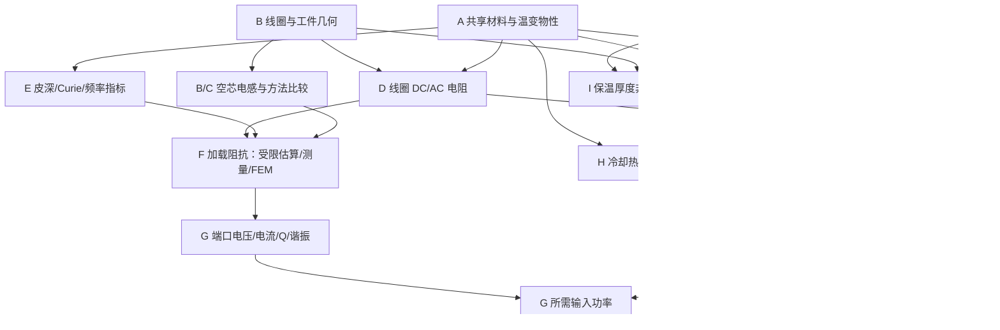

# Induction Heating Engineering Calculator — Calculation Basis

> 中文名称：电磁感应加热工程计算器计算依据  
> 状态：**v1 Gate 0 受控技术基线**  
> 版本：1.0，2026-08-14  
> 本阶段边界：只定义计算、证据、验证与警告；不实现网站，不确定前端框架。
> 技术冻结 ID：`IH-EC-V1-G0-2026-08-14-01`

## 1. 目的与批准边界

本文是未来计算器唯一的主计算技术规范。任何进入实现的公式必须在本文中具有：目的、输入、输出、SI 方程、假设、适用域、执行顺序、依赖、警告、验证案例和来源状态。为控制篇幅，短小的定义式可能把这些字段合并在一段或表格中；字段没有明确记录就表示该方法尚未获实施批准，而不是允许实现者自行补猜。

52 个编号条目的逐项计算契约汇编于 `CALCULATION_CONTRACTS.md`。方法状态分为 `approved`、`approved_with_limitation`、`deferred` 和 `insufficient_evidence`；只有前两类可进入 v1 正常计算，且受限方法必须在运行时验证适用域。后两类必须失败关闭，返回 `not_applicable`、`insufficient_data` 或 `non_converged`，不得由实现者补猜公式、默认值或经验系数。

**裁决原则：**一手来源或可复核推导、SI 量纲、物理边界、极限趋势、独立验证和不确定度共同决定采用与否。旧聊天、Excel、旧软件输出、图片、历史数值和历史反推系数只保存在 `archive/`、`working/` 与 `PROJECT_AUDIT.md` 中作研究谱系；它们不进入公式、默认值、校准、科学验证、产品 UI、运行时结果或测试验收。FEM 和试验是独立验证或参数辨识证据，不能被外推为未经证明的通用解析式。

每个结果分别记录：

| 字段 | 含义 |
|---|---|
| `scientific_confidence` | 公式来源、量纲、边界和推导可信度 |
| `input_data_quality` | 本次材料、几何、工况和测量数据质量 |
| `applicability_status` | 当前输入是否位于方法声明域 |
| `validation_status` | 方法版本是否完成规定的独立验证 |

方法类型、批准状态、结果血缘和警告严重度的唯一机器值见 `docs/METHOD_STATUS_DICTIONARY.md`。可接受的方法类型：

- `analytical`：解析或闭式工程计算；
- `engineering_correlation`：有明确试验范围的经验相关式；
- `empirical_calibrated`：仅由本项目新取得、边界清楚的校准数据建立，并绑定校准域；
- `numerical`：数值积分、求根或 ODE；
- `measurement_identified`：由端口测量辨识参数；
- `fem_or_experiment_reference`：用于验证，不伪装成通用解析式。

单点反推只允许标为 `hypothesis`。由 `P=I²R`、`Q=ωL/R` 等恒等式反算得到的结果，只证明输出内部自洽，不证明“几何与材料已正向预测”。正式边界见 `docs/decisions/V1_DECISION_REGISTER.md`；ADR-0001 的历史双轨方案已被 ADR-0002 对产品用途取代。

## 2. 计算哲学与结果表达

### 2.1 模型层级

1. **Level 1 — Analytical:** 明确几何和边界条件的解析式；用于默认工程初算和极限检查。
2. **Level 2 — Engineering approximation:** 经验式、有限长近似、高频表面面积近似；必须显示适用域和预期误差。
3. **Level 3 — Numerical:** 椭圆积分、离散匝求和、非线性热平衡求根、瞬态能量 ODE。
4. **Level 4 — Validation:** 新取得的阻抗/热工/水力试验或独立 FEM。Level 4 是辨识或验收证据，不自动产生通用公式。

### 2.2 不可可靠解析预测时的处理

以下量默认不得仅凭任意几何给出伪精确结果：复杂工件耦合系数、热态反射阻抗、邻近效应、局部铜最高温度、异形工件加热均匀性、非线性铁磁 Curie 过渡、复杂端部/引线/磁通集中器。应用应输出“需要测量/FEM/试验”，或明确显示经校准模型及其输入包络。

### 2.3 有效数字

- 默认显示位数由输入不确定度、模型级别和方法分歧共同决定，不沿用 Excel 的小数位数。
- 经验/标定模型至少同时显示最大绝对误差、最大相对误差、校准样本数、独立验证样本数和输入包络。
- 方法差异超过项目批准阈值时，结果显示范围或比较表，不静默选择一个值。
- 精确数学恒等式也不能提升其上游测量或模型的置信度。

## 3. 内部单位、符号与计算契约

### 3.1 唯一内部单位

内部只使用 SI：m、kg、s、A、K、mol、Pa、W、J、H、F、Ω、S。用户界面边界负责 mm、inch、µH、kW、L/min、Ω·cm、µΩ·cm 等转换；公式内部禁止隐式换算。

辐射使用 K。温差用 K；摄氏温差数值相同，但绝对温度四次方禁止用 ℃。频率存 Hz，角频率 `ω=2πf` 存 rad/s。电阻率存 Ω·m，电导率存 S/m。

### 3.2 共享常数

| 常数 | 符号 | 规范值 | 来源/说明 |
|---|---|---:|---|
| 真空磁导率 | `μ0` | `1.25663706127e-6 H/m` | 2022 CODATA；不再是定义上的精确 `4π×10⁻⁷` |
| Stefan–Boltzmann 常数 | `σSB` | `5.670374419e-8 W/(m²·K⁴)` | SI 定义常数派生 |
| 标准重力 | `g0` | `9.80665 m/s²` | 标准重力；局部重力可另输 |

### 3.3 每个计算的运行记录

每次计算保存：`calculation_id`、方法与版本、输入原值/显示单位/SI 值、实际采用物性及状态、方程 ID、中间量、警告、来源 ID、科学置信度、输入数据质量、适用性、验证状态、校准域（如有）、求解器容差、状态码、输出未圆整值/显示值。

### 3.4 通用输入校验

长度、面积、质量、频率、密度、导热率、比热、绝对电阻率必须大于 0；匝数必须为正整数。相对磁导率在简单线性模式必须大于 0。温度必须高于 0 K。任何超出物性表范围的值禁止静默外推。

## 4. 模块与依赖总览

| ID | 模块 | 主要输出 |
|---|---|---|
| A | Shared Material & Physical Properties | `ρe(T)`, `μr(T,H,f)`, `k(T)`, `cp(T)`, `ρm(T)` 等 |
| B | Coil Geometry & Inductance | 几何派生量、`L0`、方法比较 |
| C | Inductance Comparison & Validation | 方法分歧、限制指标、验证残差 |
| D | Coil Electrical Parameters | 长度、`Rdc/Rac`、`Pcu`、`X`, `Q` |
| E | Workpiece Electromagnetic & Heating | `δw`、频率参考指标、Curie 警告 |
| F | Coil–Workpiece Equivalent Load | `Req`, `Leq`, `M/k`、反射阻抗或辨识结果 |
| G | Heating & System Electrical | 能量、功率、时间、PF、谐振与匹配 |
| H | Cooling Water | 热负荷、流量、速度、Re、压降与风险 |
| I | Thermal Insulation Thickness | 目标表温/目标热损厚度及迭代状态 |
| J | Reusable Thermal Loss | 传导、对流、辐射、环隙、端部/热桥 |

## 5. A — Shared Material & Physical Properties

### A-01 温变物性查询与插值

**Purpose.** 为所有模块提供同一来源、同一单位和同一温度状态的物性，防止模块各填一套常数。

**Inputs.**

| 符号/字段 | 名称 | SI 单位 | 必填 | 范围/默认 | 基础 |
|---|---|---|---|---|---|
| `material_id` | 材料/状态 ID | — | 是 | 已批准记录 | 数据库 |
| `property_id` | 物性 ID | — | 是 | 见下表 | 数据库 |
| `T` | 温度 | K | 是 | 物性有效域内 | 工况 |
| `f,H,state,p` | 频率/场强/相态/压力 | 各 SI | 条件必填 | 仅依赖时 | 数据来源 |
| `interpolation` | 插值法 | — | 否 | 默认分段线性 | 审批配置 |

**Outputs.** 物性 SI 值、来源页/表/曲线、有效范围、插值区间、不确定度、是否外推。

**Equation.** 对批准的表格，在相邻点内：`y(T)=y_i+(y_{i+1}-y_i)(T-T_i)/(T_{i+1}-T_i)`。强制正值物性可在批准后使用对数插值。跨相变或 Curie 区禁止用单一高阶多项式平滑。

**Required properties.** 铜：`ρe,k,cp,ρm,αthermal`；工件：`ρe,k,cp,ρm,μr/B-H,Curie`；绝热：`k(T,湿度,密度,老化),Tmax`；水：`ρm,cp,μ,k,Tsat(p)`；表面：`ε(T,氧化/涂层)`。

**Assumptions/applicability.** 插值仅在原始数据点包络内；材料牌号、热处理、磁场和频率条件匹配。

**Sequence.** 解析材料 ID → 验证状态变量 → 找区间 → 插值 → 传递来源和不确定度 → 缓存本次运行值。

**Warnings.** 缺场强/频率、牌号不完全匹配、Curie 区数据稀疏、湿绝热却使用干态 `k`、外推。外推默认阻止。

**Validation.** 每张表做端点精确、区间单调性、单位往返、相变边界和禁止外推测试。

### A-02 水物性

冷却水热力学性质 `rho,cp,h,Tsat` 由绝对压力和流体温度按固定版本的 IAPWS-95 或 IF97 查询；动力黏度 `mu` 使用 IAPWS R12-08，导热系数 `k` 使用 IAPWS R15-11。仅在 0.1 MPa 附近且落在其原始温度域时，才可把 IAPWS SR6-08(2011) 作为独立的简化子方法。流量计算优先使用焓差 `mdot=Qcool/[h(Tout,pout)-h(Tin,pin)]`。`cp=4180 J/(kg*K)`、`rho=1000 kg/m3` 只允许在常温低压敏感性分析中作为显式 `generic_typical` 近似，不作通用常数。

### 三级材料体系与材料比较（A 模块架构）

材料解析优先级固定为：当前状态域内有效的 `project_material`（其数据质量通常为 `project_specific`）→ 用户在当前设计中明确选择的 `user_defined` → 域内 `preset_common`。预置记录的数据等级分为 `approved_reference`、`engineering_reference` 和 `generic_typical`；用户覆盖不会改写原记录，而生成带来源、版本和审计信息的新项目材料。

首批库至少覆盖高导电铜、常见碳钢/低合金钢/不锈钢/典型耐热钢、铝和铜等非铁磁工件，以及陶瓷纤维（硅酸铝）、硅酸钙和气凝胶等常用绝热材料。牌号和数值必须在独立数据审查后逐记录发布；架构批准不等于批准任意室温常数。记录结构、必需属性、温度/频率/场强范围、插值、外推、版本和质量字段见 `data/materials/MATERIAL_DATA_MODEL.md`。

Material Comparison 在同一冻结工况、几何、方法版本和求解器设置下并行替换材料记录，比较 `rho_e,mu_r,delta,f_ref,Euseful,k,insulation_thickness,Qloss,Ts` 等结果。缺关键物性时该候选返回 `insufficient_data`；不得静默借用其他材料的常数。`generic_typical` 只用于初步估算，并在结果中保持较低数据等级。

## 6. B — Coil Geometry & Inductance

### B-01 几何规范化

**Purpose.** 将内径、外径、导体尺寸、匝数和轴向定义转换为所有电感方法共用的明确几何。

**Inputs/definitions.** 全部存 SI，显示层可用 mm：

| 字段 | 冻结定义 |
|---|---|
| `D_i` | 线圈导体内表面形成的机械内径 |
| `D_o` | 线圈导体外表面形成的机械外径 |
| `D_m` | 导体几何中心线直径 |
| `D_c` | 电磁计算的实际/等效电流路径直径；v1 缺少更高阶模型时默认 `D_m` |
| `d_rad`,`d_ax` | 导体径向、轴向尺寸 |
| `p` | 相邻匝中心线轴向节距 |
| `g` | 匝间轴向净距，且仅表示 `p-d_ax` |
| `b_cc` | 第一匝至最后一匝中心线轴向距离 |
| `b_env` | 完整绕组轴向外包络长度 |
| `N` | 电气匝数 |
| `N_rev` | 实际螺旋路径转数，必要时与 `N` 分开 |
| `lead_length` | 有效绕组外引线/母排长度 |

**Equations.** 单层均匀绕组满足 `D_o=D_i+2d_rad`、`D_m=(D_i+D_o)/2=D_i+d_rad`、`g=p-d_ax`、`b_cc=(N-1)p`、`b_env=b_cc+d_ax`。禁止把 `Np`、`(N-1)p`、`b_cc` 和 `b_env` 作为同一个“线圈长度”。高频邻近效应可能使真实电流质心偏离 `D_m`；默认 `D_c=D_m` 时保留方法级警告，不伪造修正。

**Method mapping.** 机械布置和 3D 使用 `D_i,D_o,b_env`；B-03/B-04/B-05 的 v1 单层映射使用 `D_c,b_env`；B-06 只使用独立的多层绕组几何 `a_ml,b_ml,c_ml`，不得把单层 `D_m/2`、`D_c/2` 或单根导体 `d_rad` 静默代入；离散匝方法使用每匝 `D_c,i,z_i`；导体长度使用真实机械/CAD 螺旋中心路径、`D_m,N_rev,delta_z_helix,lead_length`。任何方法若需要其他轴向长度，必须在其契约中明确声明。

**Warnings.** 缺少相互独立的机械尺寸；几何恒等式残差超输入不确定度；`g<0`；多层却调用单层方法；`D_c` 高可信结果被要求但只给 `D_m`。

**Validation.** `GEO-001/002` 验证几何恒等、端点、`N=1` 和螺旋路径；本轮冻结参数、方法映射和旧命名迁移见 `docs/data-dictionary/ENGINEERING_PARAMETER_DICTIONARY.md` 与 ADR-0003。

### B-02 轴向填充系数

**Purpose.** 衡量导体轴向投影对明确参考包络的覆盖程度。

`k_fill,axial=N d_ax/b_env`。

输入均为 m，输出无量纲。它不是电磁耦合系数、槽满率或体积填充因子；只有 `0<k_fill<=1` 且几何为均匀单层时才适用。若方法希望以其他长度为基准，必须另设带语义的字段，禁止复用含糊 `L1`。

### B-03 理想长螺线管

**Purpose.** 给出长线圈极限和教学基线。

项目映射为 `a=D_c/2`、`b=b_env`；`L_inf=μ0 N² A/b`, `A=πa²`。

输出 H。假设无限长、均匀电流片、空气芯、无工件/引线/导体截面效应。只作极限/比较；`b_env/D_c` 不大时不作为默认。验证：`b_env/D_c→∞` 时有限长模型 `K_N→1`。

### B-04 Nagaoka/Lundin 有限长电流片（推荐科学基线）

**Purpose.** 计算单层圆柱、均匀电流片的有限长空芯电感。

**Inputs.** `a=D_c/2`、`b=b_env`、`N`、`μ0`；均由同一个 B-01 GeometrySnapshot 显式派生。

**Outputs.** `L_sheet` [H]、`K_N=L_sheet/L_inf`、分支和方法版本。

**Equations.** 采用 Lundin 1985 对精确 Nagaoka 电流片的稳定近似：

当 `2a≤b`：

`x=4a²/b²`

`L=μ0N²πa²/b · [f1(x)−(4/(3π))(2a/b)]`

当 `2a>b`：

`x=b²/(4a²)`

`L=μ0N²a{[ln(8a/b)−1/2]f1(x)+f2(x)}`

`f1=(1+0.383901x+0.017108x²)/(1+0.258952x)`

`f2=0.093842x+0.002029x²−0.000801x³`。

**Assumptions.** 无限薄、均匀圆柱面电流；无离散匝、粗管、螺旋、引线、邻近、工件或分布电容。

**Applicability.** 适合密绕、匝数较多的单层空芯基线。Lundin 的六位数指对电流片精确式的逼近，不是实物精度。

**Sequence.** 规范化几何 → 按 `2a/b` 选数值稳定分支 → 计算 → 长螺线管极限检查 → 与 Wheeler/离散法比较。

**Warnings.** 少匝、粗管、大节距、平均半径不确定、引线显著。触发时同时显示离散匝/测量建议。

**Method precondition.** `N=1` 或按首末匝中心距得到 `b=0` 时，本方法返回 `not_applicable`，直接路由有限截面圆环/测量；不得令长螺线管或电流片式除零。少匝但 `b>0` 仍显示模型不确定警告。

**Source/confidence.** Nagaoka 1909、Lundin 1985；在圆柱电流片模型内为高置信。实物误差由离散匝、有限截面、螺旋、引线和工件影响另行评估。

### B-05 Wheeler 1928 单层快速式

**Purpose.** 在 Wheeler 原几何和适用域内提供快速工程对照。

原式：`L[µH]=a_in²N²/(9a_in+10b_in)`，`a_in,b_in` 必须为 inch。SI 包装只在边界转换，不把毫米直接代入。

项目映射为 `a=D_c/2`、`b=b_env`，并在 trace 中同时保留原始 SI 几何与 inch 方法输入。

**Applicability.** Wheeler 原文声明 `b>0.8a` 时式(2)在 1% 内；若 `D=2a` 且定义一致，等价 `b>0.4D`。这不是硬失效线。原文短线圈式(3) `a²N²/(8a+11b)` 仅 5% 级、`2a>b>0.2a`，只放历史比较。

**Warnings.** 直径代入半径式、mm/inch 混用、少匝/大节距、`b≤0.8a`。不得再乘 Nagaoka 系数（会重复有限长修正）。

**Method policy.** 不设置 `b_env/D_c=0.4` 硬切换。所有适用的方法都可并行计算；正常视图以 B-04 为 Recommended method，B-05 显示原适用域和方法差异。

### B-06 Wheeler 多层式

**Purpose.** 对真正的均匀多层绕组提供 Wheeler 1928 的快速工程估算；不属于单层方法的自动替代。

**Original equation and units.** Wheeler 原文 Figure 1、Equation (1)：

`L[µH]=0.8 a_in² n²/(6a_in+9b_in+10c_in)`。

`a_in` 为整个多层绕组截面的平均半径、`b_in` 为轴向绕组长度、`c_in` 为总径向绕组厚度，三者均以 inch 输入；`n` 为总电气匝数；输出为 µH。项目内部仍使用 SI，并在方法边界显式执行 m→inch、µH→H。项目符号映射为 `a_ml:=a`、`b_ml:=b`、`c_ml:=c`、`N:=n`；若历史实现写 `t`，只允许作为 `c_ml` 的迁移别名，不得改写原文变量。

**Source.** Harold A. Wheeler, “Simple Inductance Formulas for Radio Coils,” 1928，受控文件 `references/external_sources/wheeler1928.pdf`，PDF 1、印刷页 1398、Figure 1、Equation (1)。

**Applicability and accuracy.** 原文约 1% 的声明只适用于绕组形状近似 Figure 1、且分母三项 `6a`、`9b`、`10c` 数量级大致相当的情形。离开该形状条件时可保留为受限比较值，但不得继续宣称约 1% 精度。必须确认 `coil.layer_count>=2`、匝在多层截面内近似均匀分布，并显式提供 `a_ml,b_ml,c_ml,N`。单层粗铜管具有导体厚度不等于“多层”；禁止由 `d_rad>0`、导体为空心或存在径向壁厚自动触发 B-06，也禁止用 `D_c` 替代多层机械平均半径。

**Status.** `approved_with_limitation`；只在上述原始几何与单位映射闭合时运行，否则 `not_applicable`。它不参加单层 B-04/B-05 的 Recommended 选择。

### B-07 离散同轴圆环求和

**Purpose.** 为少匝、大节距线圈提供比电流片更贴近离散几何的高级基线。

`L=Σ_i L_i+2Σ_{i<j}M_ij`。

同轴丝状圆环：

`k²=4a_i a_j/[(a_i+a_j)²+z_ij²]`

`M_ij=μ0√(a_i a_j){[(2/k)−k]K(k)−(2/k)E(k)}`。

细圆实心线、均匀电流近似单匝自感：`L_i≈μ0a_i[ln(8a_i/r_c)−7/4]`，要求 `r_c/a≪1`。空心粗管、矩形管和强趋肤不能沿用该常数而不说明。

**Numerics.** 使用可靠完全椭圆积分库/Carlson 算法。`i=j,z=0` 不得调用互感式，以免发散。

**Limitations.** 每匝被视作平面圆环，仍忽略真实螺旋、有限截面电流分布、引线和邻近效应。最终少匝感应线圈建议实测/FEM。

### B-08 Simpson 数值积分

Simpson 法只用于计算 `K(k),E(k)` 的教学/复核：分段数为偶数，做 `n,2n,4n` 收敛并与权威库比较；`k→1` 时固定步长收敛慢。它不是第四种电感物理模型，正常 UI 不与 Wheeler/Nagaoka/离散匝并列。

## 7. C — Inductance Comparison & Validation

### C-01 方法比较

**Inputs.** B 模块同一个冻结 GeometrySnapshot、各方法版本、适用域结果及验证来源。所有方法必须消费同一机械几何；方法级派生量须在 trace 中显示。

**Outputs.** 每个方法的 `L,status,applicability,source,assumptions,warnings`，以及 `recommended_method_id,recommended_reason`。存在合格 Recommended 时才输出相对差和以该结果为分母的方法极差；没有合格解析方法但仍有可展示的限域比较结果时，`recommended_method_id=null`、`result_status=success_with_warnings` 并发出 `no_approved_recommended_result` warning；没有任何方法可运行时按原因返回 `not_applicable` 或 `insufficient_data`。不得为填满字段选择最接近的公式或方法平均值。

**Dimensionless ratios.** 单层比较统一显示 `b_env/D_c`、`p/d_ax`、`d_rad/D_c`、`N`、`k_fill,axial=N d_ax/b_env`。`N=1` 时 `p/d_ax` 为 `not_applicable`。这些比值用于解释几何和方法分歧，不自动创造修正系数，也不作为未经批准的通用硬切换阈值。

**Recommended policy.**

1. 对空气芯、均匀单层、圆柱面安匝且 B-04 电流片假设成立的工况，`recommended_method_id=B-04`；B-03 只作长线圈极限检查，B-05 只作 Wheeler 原适用域内的快速比较。
2. 少匝、稀疏或实体截面使电流片假设不足时，不按任意统一的 `N`、节距比或方法差阈值自动切换。只有当 B-07 自身全部前提成立——每匝可表示为同轴平面圆环、`z_i` 和半径完整、导体为该自感子模型支持的薄圆实心线、截面电流假设匹配，且不存在被忽略后仍显著的空心/矩形截面、强趋肤、真实螺旋或引线影响——B-07 才可成为该离散理想化的 Recommended analytical method。
3. 若 B-04 不再适用且 B-07 的薄圆实心假设不成立，例如少匝粗空心圆管或矩形水冷导体，则不提供解析 Recommended；B-03/B-04/B-05 只能保留为清楚标注限制的参考/比较结果，并输出测量或 EM FEM 建议。
4. `N=1` 不调用 B-03/B-04 多匝电流片链；只有匹配截面自感模型的 B-07 子方法可推荐，否则同样返回无解析推荐。
5. B-06 由独立多层几何路由管理，不由单层 Recommended 策略自动触发。

不为匝数、上述几何比值或方法差百分比设置通用硬阈值。未来若项目需要 warning 门槛，必须作为带来源、版本和批准域的项目 QA 规则另行登记，不能冒充原论文适用边界。

**Comparison rule.** 方法分歧只暴露模型不确定度；不以任一历史输出为目标，不将多个解析结果求平均作为默认，也不把两个方法接近称为独立物理验证。

**Validation cases.** 长、中、短、单匝和 3–5 匝限制案例；见 `VALIDATION_CASES.md`。案例只使用解析极限、公开来源、新测量或独立 FEM。

## 8. D — Coil Electrical Parameters

### D-01 导体中心线长度

**Purpose.** 为电阻、质量和压降提供真实长度。

单层圆柱螺旋、不含引线：`ℓ_helix=sqrt[(πD_m N_rev)^2+delta_z_helix^2]`。这里使用机械中心路径直径 `D_m` 或等价的 CAD 导体中心线，而不是电磁等效电流路径 `D_c`；`N_rev` 是实际完整/部分螺旋周数，`delta_z_helix` 是该路径两端的总轴向前进量。不能仅因电气匝数显示为 `N` 就假定端点轴向定义完全相同。理想连续 `N` 匝路径可显式取 `N_rev=N`，但若几何以首末匝中心距 `b_cc=(N−1)p` 给出，应由布线端点规则确认总轴向前进量，不能一边使用 `(N−1)p` 一边无说明使用 `Np`。总长 `ℓ=ℓ_helix+ℓ_leads+ℓ_bus`。若只用 `NπD_m`，必须显示忽略螺旋轴向分量的相对误差。多层/非圆路径按逐段 CAD 中心线几何求和。

输入 m、匝数；输出 m。引线未知时输出下界并警告。

### D-02 金属截面积

| 导体 | `A_metal` |
|---|---|
| 实心圆 | `πd_o²/4` |
| 空心圆管 | `π(d_o²−d_i²)/4` |
| 实心矩形 | `w t` |
| 矩形管 | 外矩形面积−内孔面积 |

尺寸必须为正，内尺寸小于外尺寸。输出 m²，并保留水力面积 `A_h` 为独立量；两者不得混用。

### D-03 DC 电阻

导体本体 `R_conductor,dc(T)=ρe,Cu(T)ℓ/A_metal`；端口值 `R_terminal,dc=R_conductor,dc+ΣR_joint+R_bus`。接头/母排若已包含在测得端口电阻中不得再加一次。

**Inputs.** D-01、D-02、铜温度/物性、接头/母排电阻（可选）。**Outputs.** 分列本体与端口 Ω。**Assumptions.** 各分段温度和截面可定义；若非均匀温度则逐段 `Σρ(T_i)ℓ_i/A_i`。**Warnings.** 使用 20 ℃电阻率计算热铜、忽略或重复计入接头/母排。**Validation.** 长度和面积缩放、材料表端点、四线测量。

### D-04 铜导体趋肤深度

`δ_cu=√[ρe,Cu(T)/(πfμ0μr)]`，铜通常 `μr≈1`。

输出 m；适用线性、各向同性、正弦稳态良导体。`rho_e`、`mu_r` 和温度必须来自同一材料状态；单位只在边界转换。该量是半无限介质的特征衰减深度，不直接等于有限铜管的有效导电厚度。

### D-05 AC 电阻分级

**Recommended method.** 使用四端口/阻抗法在实际频率、铜温、引线和装载状态下获得 `Rac_measured(f,T,state)`；测量不确定度和去嵌入边界随结果保存。

**v1 engineering estimate.** 对孤立、长直、实心圆导体，且 `r_o/delta>=10`、场沿周向近似均匀、相邻导体和工件的邻近效应可忽略时，强集肤一阶估算：

`A_eff=2*pi*r_o*delta`，`Rac_skin=rho_e*l/A_eff`。

对空心圆管，只有 `t_wall/delta>=3` 且电流主要位于已声明的外表面时才可使用同一外周长筛选式；不得默认把内外周长相加。结果命名为 `Rac_skin_screening`，状态 `success_with_warnings`，并输出 `Rac/Rdc`、`r_o/delta`、`t_wall/delta`。阈值是保守的 v1 适用门禁，不代表邻近效应精度保证。

**Deferred.** 实心圆 Bessel/Kelvin 全频内部阻抗、空心/矩形精确内部阻抗、螺旋曲率、相邻匝/工件/母排邻近效应和局部电流拥挤需专项来源、实测或 FEM。没有匹配几何的方法时不提供无来源 `F_prox`；用户仍可输入带来源的 `Rac_measured`，并明确显示“实测更准确”。

### D-06 电流密度与损耗

`J_dc=I_rms/A_metal`；高频表面平均仅在 D-05 适用时 `J_eff=I_rms/A_eff`。`P_Cu=I_rms²R_ac`。

RMS/峰值必须显式。若 `R_ac` 来自 `P_Cu/I²`，输出标为反算。损耗可进入 H 冷却热负荷，但不得自动把全部系统损耗计入线圈水路。

### D-07 线圈串联端口参数

`X_L=ωL_s`；`Z_s=R_s+jX_L`；`|Z|=√(R_s²+X_L²)`；`Q_s=ωL_s/R_s`；`U_rms=I_rms|Z|`，其有功/无功分量 `U_R=IR_s`、`U_X=IωL_s`。

`U≈IomegaL` 只能作为 `R_s<<omegaL_s` 的显式近似，并同时报告完整复数结果及近似误差。所有量须为同一频率、同一串联等效、同一 RMS 端口。谐振槽内线圈电压不能与网侧电压直接比较。

**Validation.** 使用合成 `R,L,f,I` 精确复算并检查被动性、RMS/峰值和单位；装载端口使用新测复阻抗案例。

## 9. E — Workpiece Electromagnetic & Heating Parameters

### E-01 工件参考透入深度

**Purpose.** 给出正弦稳态下电磁场/电流幅值的 `1/e` 参考尺度，用于频率与几何初筛。

**Inputs.**

| 符号 | 名称 | SI 单位 | 必填 | 范围/来源 |
|---|---|---:|---|---|
| `f` | 频率 | Hz | 是 | `>0`，电源工况 |
| `ρe,w(T)` | 工件电阻率 | Ω·m | 是 | 材料 A 模块 |
| `μr,w(T,H,f)` | 有效相对磁导率 | 1 | 是/场景 | 材料 A；非铁磁可近似 1 |
| `T,H,state` | 温度、场强、组织 | K, A/m, — | 铁磁必填 | 材料状态 |

**Output.** `δw` [m]，以及输入物性、温度区间和不确定度。

**Equation.**

`δw=√[ρe,w/(π f μ0 μr,w)]`。

场量 `J(y)=Js exp[−(1+j)y/δ]`，幅值按 `exp(−y/δ)` 衰减；半无限平面中一皮深内焦耳热比例为 `1−e⁻²≈86.47%`，不是“86.5% 电流”。

**Assumptions.** 线性、均匀、各向同性良导体；正弦稳态；局部半无限平面；忽略位移电流。

**Applicability/warnings.** 工件厚度/半径与数倍 `δ` 同量级、薄壁管内外场叠加、铁磁饱和/Curie、边缘/槽口/异形、脉冲/谐波或热扩散显著时，`δ` 只作参考。不得将电磁皮深直接称为最终热影响深度。

**Validation.** `E-SKIN-001` 使用独立 SI 输入检查绝对值和 `delta proportional sqrt(rho/(f mu_r))` 缩放；所有非 SI 电阻率只在边界显式转换。

### E-02 Curie 与温度扫描

**Purpose.** 显示加热过程中 `ρe`、`μr` 和 `δ` 的变化，而不是用室温常数贯穿全程。

**Method.** 在批准温度节点 `T_i` 查询 `ρe(T_i)` 与 `μr(T_i,H,f)`，计算 `δ(T_i)`；Curie 过渡区加密节点。材料无可靠磁数据时输出情景带，如 `μr_low/nominal/high`，不输出单一高精度曲线。

**Warnings.** Curie 温度因材料牌号/成分而异，禁止把 700 ℃或 760 ℃固定给所有钢。若 `μr` 只有冷态单点，进入过渡区时标记 `FEM/experiment recommended`。

**Validation.** 在同 `ρ,f` 下 `μr:100→1`，皮深恰放大 10 倍；实际案例还应叠加 `ρ(T)`。

### E-03 参考临界频率与穿透比

**Purpose.** 为实体圆柱透热提供频率/均匀性折中的参考点，不宣称“最佳频率”。

定义无量纲穿透比 `Π_D=D/(2δ)`；若采用历史经验点 `Π_D=2`（即 `δ=D/4`）：

`f_ref=16ρ/(πμ0μrD²)`。

等价工程单位有两种常见写法，必须与电阻率单位绑定：

- `f_ref[Hz]≈4.05285×10⁸ ρ[Ω·cm]/(μr D[cm]²)`；
- `f_ref[Hz]≈405.285 ρ[µΩ·cm]/(μr D[cm]²)`。

历史论文把式中 `ρ` 标成 `µΩ·cm`，却在算例中代入 `115.6×10⁻⁶ Ω·cm`，属于单位标注/使用不一致。其 `4×10⁸` 只与 `ρ[Ω·cm]` 兼容；实现只采用上方 SI 式。

**Applicability.** 实体圆柱、目标温度物性、初步透热选择。薄壁管应显示 `t_wall/δ`，不能把实体圆柱外径判据直接套用。功率密度、加热时间、热传导、电源能力和 Curie 仍需共同权衡。

## 10. F — Coil–Workpiece / Equivalent Load

### F-01 线性双绕组反射阻抗估算

**Purpose.** 解释线圈加载后等效电阻增加和电感变化，并在 `M,R2,L2` 已知时计算反射量。

**Inputs.** 一次 `R1,L1`；二次等效 `R2,L2`；互感 `M`；频率 `f`。所有量必须属于同一线性等效拓扑和频率。

**Equations.** 采用被动符号约定，`Z2=R2+jωL2`：

`Zin=R1+jωL1+ω²M²/(R2+jωL2)`

`Rref=ω²M²R2/[R2²+(ωL2)²]`

`Leq=L1−ω²M²L2/[R2²+(ωL2)²]`

`Req=R1+Rref`。

耦合系数定义 `k=M/√(L1L2)`，线性无源模型中 `0≤k≤1`。

**Assumptions.** 线性集中参数、正弦稳态、所选二次等效有效。点标/电流方向可改变中间符号，但被动负载 `Rref` 必须非负。

**Limitations.** 公式能算给定参数的反射代数，不代表能从线圈—连续工件几何可靠得到 `M,R2,L2`。`M` 或 `k`、`R2,L2` 必须来自明确的解析简化、项目测量、独立 FEM 或带来源的用户输入；同时运行上下界/敏感性情景。铁磁、短线圈、端部和热态通常需 FEM/测量。结果标 `estimate`，并注明 F-02 实测更准确。

**Warnings.** `k>1`、`Rref<0`、不同频率参数混用、把 `Leq/L0` 直接称耦合系数。`Leq<L0` 是短路导电工件常见现象，不是无条件定律。

### F-02 端口阻抗测量辨识（实际设备 Recommended method）

**Purpose.** 在实际频率、空载/装工件和不同温度下获取串联端口 `Req,Leq`。

**Inputs.** `V_rms,I_rms,P,f`，以及相位或无功符号；测量状态、夹具/引线去嵌入、温度。

`|Z|=V/I`; `Req=P/I²`; `X=sign(Qreactive)√(|Z|²−Req²)`；感性时 `Leq=X/ω`；`Qs=ωLeq/Req`。若测量不确定度使 `|Z|²−Req²` 略小于 0，只有在误差传播证明其与 0 相容时才可钳为 0 并发警告；超出合成不确定度则返回 `inconsistent_measurement`，禁止静默取绝对值。

若只有 `P,I`，只能得到 `Req`，不能唯一得到 `Leq`。非正弦系统须说明是基波量还是全波 RMS/有功；不得用 `cosφ` 代替真实 PF。

**Outputs.** `Z(f,T,state)`、不确定度、空/载差值。**Validation.** 用已知合成 `R,L` 和标准件；真实线圈在工作频率测空载、冷工件、热态节点。

### F-03 项目专用经验负载模型（Deferred）

**Purpose.** 在未来取得独立项目数据后，为固定设备族建立受限 `Req/Leq` 响应面；它不是 v1 的通用几何公式。

**Inputs.** 新取得且边界清楚的校准数据、几何/材料/频率/温度特征、不可变数据清单、独立验证集和校准域。

**Method.** 采用最少参数、保持被动性和量纲的候选关系；在冻结训练方案前划分校准集和验证集。报告 `MAE,RMSE,max_relative_error`、不确定度、样本数和多维适用包络。域外必须返回 `not_applicable`。

**Prohibited.** 使用历史输出或旧反推系数；同一数据既拟合又验证；为单个案例设置隐蔽修正；让经验值覆盖 F-02 测量；把统计相关称为普适耦合定律。

**Status.** `deferred`。在新数据协议、校准/验证分离和验收阈值获批前，不进入产品方法注册。v1 对实际设备采用 F-02；需初算时采用 F-01 的显式参数情景并显示估算标签。

## 11. G — Heating & System Electrical Calculations

### G-01 批次工件有用热量

**Purpose.** 计算工件从 `Ti` 到 `Tf` 的目标热需求。

`E_sens=m∫[Ti,Tf]cp(T)dT`

`E_useful=E_sens+mΣΔh_phase+E_reaction`。

输入 `m` [kg]、温度 [K]、`cp` [J/(kg·K)]、相变/反应焓 [J/kg 或 J]；输出 J。常数 `cp` 只在窄温域或用户明确选择平均值时使用，并显示误差假设。

**Warnings.** `Tf≤Ti`、物性外推、跨相变无潜热、把炉管/流体/反应热边界混在一起。

### G-02 连续工艺有用功率

`P_useful=ṁ[∫cp(T)dT+ΣΔh_phase+Δh_reaction]`。

输入 `ṁ` [kg/s]；输出 W。不得把 kg 与 kg/s 混用。本项目裂解炉是连续过程：稳态有用功率主要是流体显热/反应焓，炉管升温只属于启动瞬态，不能套普通“工件质量×比热”代替工艺热负荷。

### G-03 加热时间/瞬态温度

推荐求解：`mcp(T)dT/dt=P_wp,abs(T,t)−Qloss(T,t)−P_phase/reaction(T)`。

只有净功率可视为恒定平均值时：`t≈E_useful/(P_wp,abs−Qloss)`。分母 `≤0` 时目标不可达。跨 Curie、相变或强辐射时，禁止只给 `mcpΔT/P` 的伪精确结果。

### G-04 功率边界与效率

规范量：`P_grid` 网侧有功、`P_inv,out`、`P_coil,term`、`P_Cu`、`P_wp,abs`、`P_useful`、`Qloss,wp`、`Qcool`。

`ηinv=P_inv,out/P_grid`

`ηcoil→wp=P_wp,abs/P_coil,term`

`ηthermal=P_useful/P_wp,abs`

`ηoverall=P_useful/P_grid`。

每个效率必须有边界、来源和同一时间基准。无功功率不是热损失。若只有实测或厂家给定的总效率，它作为明确的总边界输入，不再与分级效率重复相乘。

### G-05 需要的输入功率

`P_wp,abs=P_useful+Qloss,wp`

`P_coil,term=P_wp,abs+P_Cu+P_stray,local`

`P_grid=P_coil,term/(ηmatching ηinverter ηrectifier ηother)`。

所有未知损耗允许显示“未计入”，不得默认 0 后称总功率完整。

### G-06 视在功率与功率因数

单相/等效端口 `S=V_rms I_rms`，真实 `PF=P/S`。三相平衡网侧 `S=sqrt(3) U_LL I_L`。`cos(phi)` 仅适用于近似正弦；含谐波须用真实 PF。线圈端、网侧、变压器两侧和逆变器基波不得混为一个端口。

### G-07 串联谐振

明确普通串联 RLC 时：

`Zs=R+j(ωL−1/(ωC))`，`f0=1/(2π√(LC))`，给定 `L,f0` 时 `C=1/(ω0²L)`。

`L` 必须说明是空载、加载或设计工作点的串联等效。实际 `L(T,f)` 变化、器件寄生和谐波会偏移谐振。

### G-08 并联谐振

拓扑必须先选择：

- 理想 `R||L||C`：`Y=1/Rp+j(omega C-1/(omega L))`，`omega0=1/sqrt(LC)`；
- 实际线圈串联支路 `(Rs+jomegaL)||C`：`Y=1/(Rs+jomegaL)+jomegaC`。令输入电纳虚部为零得
  `omega0^2=1/(LC)-(Rs/L)^2`，等价 `C=L/[Rs^2+(omega0 L)^2]`；只有右侧为正时存在该并联谐振点，且谐振时 `Zin=L/(C Rs)`。

输出必须声明端口、支路电流/电压和损耗位置；不能复用串联 RLC 的应力关系。寄生、开关谐波和匹配网络未建模时显示限制。

### G-09 LLC/多谐振拓扑

LLC 作为高级功能 `deferred`。任何方法必须绑定完整电路图、端口、`Ls,Lm/Leq,Cr/Cp,Req` 和基波/全波假设。项目文献中的特定三阶网络只能在其原拓扑、FHA 和高 Q 条件核清后作为独立方法，不能称通用 LLC。未知拓扑时返回 `insufficient_data`，不计算唯一谐振电容或增益。

### G-10 匹配变压器

理想变比只允许在明确端口、绕组方向和 RMS/基波定义后使用 `n=Np/Ns=Vp/Vs=Is/Ip`、`Zp=n^2 Zs`。实际漏感、励磁支路、绕组损耗、磁芯损耗和饱和另建模型。不得把整流系数跨电路通用化。

## 12. H — Cooling Water

### H-01 冷却热负荷

`Qcool=P_Cu+Qpickup,wp+P_magnetic_material+P_other_cooled`。

每项标“测量/解析估计/FEM/设计裕量”。炉体向环境热损、工件有用热、无功和整厂损耗不自动进入线圈水路。多回路分别计算再汇总。

### H-02 基础质量/体积流量

**Purpose.** 从明确冷却负荷和允许温升求理论流量。

优先使用单相焓差：`mdot_w=Qcool/[h(Tout,pout)-h(Tin,pin)]`，`Vdot=mdot/rho`。仅在物性变化可忽略时用 `mdot=Qcool/(cp_bar DeltaT)`。

输入 W、K、绝对 Pa 和 A-02 水物性；输出 kg/s、m3/s，显示层可用 L/min。`DeltaT<=0`、焓差非正、压力未知或接近相界时阻止。设计裕量作用于明确热源/工况情景并单列，不设通用冷却系数。

### H-03 支路、水力面积与速度

圆管 `Ah=πdi²/4`；`v=V̇branch/Ah`。矩形通道用实际流通面积，水力直径 `Dh=4Ah/Pwetted`。

多支路只在几何/阻力近似相同且已平衡时均分流量，否则联立同压降管网或测量。输出 m/s。

速度数值不自动判定“合格”；允许范围由实际线圈、电源、泵、水质和材料的 OEM/项目规范提供。支路未知、阻力不同时不得默认均分。

### H-04 Reynolds 与内部换热

`Re=ρvDh/μ`；`Pr=cpμ/kf`；`h=Nu kf/Dh`。

批准的受限直圆管方法：

- `fully_developed_straight_round_laminar_CWT`：`Re<2300`、恒壁温、热/水力充分发展，`Nu_D=3.656`；
- `fully_developed_straight_round_laminar_CWF`：`Re<2300`、周向与轴向恒热流、充分发展，`Nu_D=4.364`；
- `straight_smooth_round_Gnielinski_1975`：直、光滑、充分发展、单相圆管，项目域 `1e4<=Re<=5e6`、`0.5<=Pr<=2000`，
  `f_G=(1.82log10(Re)-1.64)^(-2)`，
  `Nu=[(f_G/8)(Re-1000)Pr]/[1+12.7sqrt(f_G/8)(Pr^(2/3)-1)]`。

`2300<=Re<1e4` 为 Deferred，不插值。螺旋曲率、入口、非圆水道、显著物性变化、局部 AC 热点和两相换热不在上述方法内；直管值只能作 screening，不能签发局部无沸腾结论。

### H-05 压降与并联管网

`Delta p=f_D(L/Dh)(rho v^2/2)+sum K_j(rho v_j^2/2)+rho g0 Delta z`。`f_D` 明确为 Darcy 因子；Fanning 数据须显式乘 4。直圆管层流 `f_D=64/Re`；湍流直圆管在 `Re>=1e4` 且实际绝对粗糙度 `epsilon` 有来源时，用 Colebrook 正根：

`1/sqrt(f_D)=-2log10[epsilon/(3.7Dh)+2.51/(Re sqrt(f_D))]`。

`2300<Re<1e4`、螺旋压降修正和未知老化粗糙度为 Deferred。并联网络满足节点质量守恒和同两节点支路压差相等，再与厂家泵曲线求交；缺拓扑、`K`、粗糙度或泵曲线时，只能报告给定流量的已知部分压差或 `insufficient_data`。

### H-06 沸腾、结垢、腐蚀和空化警告

- 分段能量式 `dh_b/dz=q'_cool(z)/mdot`；`q''_i=q'_cool/P_i`；直管平均筛选 `T_wi=T_b+q''_i(1/h_i+R''_f)`。
- `DeltaT_sub,bulk=Tsat[p_abs(z)]-T_b(z)`；`DeltaT_sub,wall=Tsat[p_abs(z)]-T_wi(z)`。`DeltaT_sub,wall<=0` 时单相模型失效；大于 0 也只表示未到平衡饱和温度，不自动等于安全裕量。
- `NPSH_A=p_suction,static,abs/(rho g0)+v_s^2/(2g0)-p_sat(T_s)/(rho g0)`，并按实际基准补齐高程/损失；只与同流量、转速和液体定义的厂家 `NPSH_R` 比较。
- 水质、结垢、腐蚀、允许速度/压力/温度阈值由 OEM/项目规范提供。缺绝对压力、局部热流、泵曲线或门槛时输出 warning/`insufficient_data`，不判安全。

### H-07 同控制体水侧能量守恒

对新取得、同时段、同回路的数据计算 `Qwater=mdot[h_out-h_in]`，并与 H-01 分项热负荷作残差和不确定度比较。可反解任一变量，但不得自动修改测量值。历史冷却数值不参与输入、默认、校准或验证；它们只保留在项目审计归档。

## 13. J — Reusable Thermal-Loss Components

### J-01 圆筒径向导热

单层、恒定 `k`：`Qcond=2πLk(Ti−To)/ln(ro/ri)`。

多层单位长度热阻：`R'cond=Σ ln(ri/r{i−1})/(2πki)`；总热阻 `Rcond=R'cond/L`。温变 `k(T)` 时按层平均温度迭代或积分导热率，并检查每层温度上限。

**标准对照处理.** 当前持有的 GB/T 8175—2025 文本中式(7)的多层对数项与独立 Fourier 分层热阻写法存在疑义。在正式澄清前不直编该印文；v1 使用可独立推导且量纲闭合的 `sum ln(r_i/r_{i-1})/(2pi k_i L)`。这是一项暂行工程处理，不声称标准已被正式判错。

### J-02 外表面对流

公共定义：膜温 `Tf=(Ts+Tinf)/2`（若原方法另有规定则按原法），`Ra_X=g0 beta |Ts-Tinf| X^3/(nu alpha)`，`h_c=Nu_X k_f/X`，`Qconv=h_c A(Ts-Tinf)`。

批准的受限子方法：

- `CC75_vertical_plate_all_range`：无约束静止流体中的竖直平面，`L` 为沿重力方向高度；项目门禁 `Ra_L<=1e12`：
  `Nu_L={0.825+0.387Ra_L^(1/6)/[1+(0.492/Pr)^(9/16)]^(8/27)}^2`。
- `CC75_horizontal_cylinder`：长、孤立、端部可忽略的水平外圆柱，`D` 为外径；项目域 `1e-5<=Ra_D<=1e12`：
  `Nu_D={0.60+0.387Ra_D^(1/6)/[1+(0.559/Pr)^(9/16)]^(8/27)}^2`。
- `CB77_circular_cylinder_crossflow`：单根圆柱均匀横掠强制对流，`Re_D Pr>=0.2`：
  `Nu_D=0.3+[0.62Re_D^(1/2)Pr^(1/3)]/[1+(0.4/Pr)^(2/3)]^(1/4)*[1+(Re_D/282000)^(5/8)]^(4/5)`。

竖直圆筒只有在曲率可忽略且采用已批准判据时才能路由竖直平板；混合对流、任意倾角、水平板、阵列/遮挡、有限端部和非横掠风为 Deferred。不能无来源地取自然/强制结果的最大值或幂和。固定 `h` 仅作为有测量或项目批准来源的用户输入。

### J-03 辐射

向大环境、视因数约 1：`Qrad=εσSB A(Ts⁴−Tsur⁴)`。

同心两灰表面之间应采用与面积比、发射率和视因数一致的辐射网络；若以内表面面积为基准、长同心圆筒且端部忽略：

`Qrad=σA1(T1⁴−T2⁴)/[1/ε1+(A1/A2)(1/ε2−1)]`。

简式 `epsilon_eff=1/(1/epsilon1+1/epsilon2-1)` 只对应等面积、视因数 1 的两灰表面；保温外径与线圈内径不同且有填充/开口时，不能无条件使用。温度必须 K。

### J-04 线性化表面换热系数

`hr=εσSB(Ts⁴−Tsur⁴)/(Ts−Tsur)`；`hs=hc+hr`，仅在同一面积与边界上组合。若 `Ts=Tsur` 用导数极限 `4εσT³`。

### J-05 线圈—保温层同心环隙

**Purpose.** 计算保温外表面到线圈内表面的自然对流/导热与辐射热拾取。

**Required geometry.** `D_ins,o=D_wp,o+2delta_ins`；真实单边径向净隙是机械派生量 `s_ann=(D_i-D_ins,o)/2`，不得同时把 `D_i,D_ins,o,s_ann` 作为三个彼此独立的自由输入。若由测量直接提供 `s_ann`，必须保存独立 geometry mapping，并与机械直径关系做残差检查。若机械内径确需由中心线几何导出，使用 `D_i=D_m-d_rad`，禁止用电磁等效 `D_c` 反算机械边界。偏心时 `s_ann,min=s_ann-e_ann`。匝间轴向净距仍为 `g=p-d_ax`；热工不得复用 `g`。必须输入姿态、封闭/开口、外壁是否连续、长度、端部、温度、气体状态、发射率和视因数信息；边界不足返回 `insufficient_data`。

**Path 1 — horizontal closed continuous concentric annulus (`approved_with_limitation`).** 令 `s=(D_cold-D_hot)/2`，

`Ra_s=g0 beta DeltaT s^3/(nu alpha)`，

`F_cyl=[ln(D_cold/D_hot)]^4/{s^3[D_hot^(-3/5)+D_cold^(-3/5)]^5}`，

`k_eff/k=max{1,0.386[Pr/(0.861+Pr)]^(1/4)(F_cyl Ra_s)^(1/4)}`，

`q'_gas=2pi k_eff DeltaT/ln(D_cold/D_hot)`。

域：`0.7<=Pr<=6000`、`100<=F_cyl Ra_s<=1e7`、`1.15<=D_cold/D_hot<=8`；低于 100 回到静止气体导热。要求足够长、同心、内热外冷且外壁连续封闭。

**Path 2 — vertical closed continuous concentric annulus (`approved_with_limitation`).** `K=r_o/r_i`、`H=L/s`、`Nu_s=h_s s/k`。Thomas–de Vahl Davis 分区：

- 导热区 `Nu_s=0.595Ra_s^0.101 Pr^0.024 H^-0.052 K^0.505`；
- 过渡区 `Nu_s=0.202Ra_s^0.294 Pr^0.090 H^-0.246 K^0.423`；
- 边界层区 `Nu_s=0.286Ra_s^0.258 Pr^0.006 H^-0.238 K^0.442`。

保守域 `Ra_s<=2e5`、`0.5<=Pr<=5`、`1<=K<=4`、`1<=H<=20`。分区边界只在 `H=1` 或 `H>=5` 使用；`1<H<5` 不自行插值。

**Fail-closed paths.** 竖直上下开口烟囱、封闭轴向热流腔、显著偏心/端部/遮挡及离散开放螺旋均为 Deferred，返回 `insufficient_data` 并建议 CFD/试验。没有连续冷外壳时 J-05 `not_applicable`，路由 J-02。`Nu=0.59Ra^(1/4)` 不得作为环隙方法。辐射始终由 J-03 独立计算并与气体传热并联；水温不等于铜壁温。

### J-06 总稳态热损

`Qloss,total=Qconv+Qrad+Qends+Qbridges+Qopenings`，每项必须属于同一控制体且不重复。侧壁一维模型缺端部/支架时单列“未计入”。经验附加百分比只有来源和对象明确时使用；旧聊天无来源的 5%–15% 泄漏不作默认。

### J-07 瞬态热损

可在 G-03 时间积分中逐步调用当前 `Ts,Tsur,h,k,ε`。若温度分布显著，采用集总热容前检查 Biot 数 `Bi=hLc/k_solid`；不满足时建议 1D/2D 瞬态导热或 FEM。

## 14. I — Thermal Insulation Thickness

### I-01 目标外表面温度法

**Purpose.** 求使外表面不超过 `Ts,target` 的最小厚度。

**Inputs.** `ri,L,Ti,Ts,target,Ta,Tsur`；各层 `k(T),Tmax`；外表面发射率；对流几何/风速；厚度上限和圆整步长。

**Unknown/output.** 外半径 `ro`、厚度 `δ=ro−ri`、实际热损、层间温度、求根残差。

**Equation.**

`F(ro)=Qcond(ro,Ti,Ts,target)−2πroL[hc(ro,Ts)(Ts−Ta)+εσ(Ts⁴−Tsur⁴)]=0`。

多层使用 J-01 热阻；外表面使用 J-02/J-03。求根中更新 `k(T)`、流体物性和 `h`。

**Solver.** 从略大于 `ri` 到工程上限扫描找变号区间，用 Brent/二分；保存容差和迭代。厚度向上圆整后重新求实际 `Ts`、热损及界面温度。

**Warnings.** 无根、材料超温、相关式超域、湿度/热桥缺失、平壁误用。

**Validation.** `INS-FOURIER-001`、`INS-VARK-001` 和 `INS-ROUND-001` 分别验证常 `k` 解析恒等、变 `k` 积分和向上圆整后重算；不使用历史输出作验收值。

### I-02 目标允许热损法

**Purpose.** 求总热损、线热损或指定面积基准热流不超过限值的最小厚度。

联立未知 `ro,Ts`：

`Qlimit=Qcond(ro,Ti,Ts)`

`Qlimit=2πroL[hc(ro,Ts)(Ts−Ta)+εσ(Ts⁴−Tsur⁴)]`。

若输入 `q'_limit[W/m]`，`Qlimit=q'L`；若输入 `q''[W/m²]`，必须声明以内表面、裸管或未知绝热外表面积为基准。

**物理解与求解顺序.** 只接受 `ro>ri`、`0 K<Ts≤Ti`、向外净热流以及材料温限内的根；通常还要求 `Ts≥max(Ta,Tsur)`。对每个候选 `ro`，先在该物理温区内求表面能量平衡，再求 `Q(ro)−Qlimit=0`。若临界绝热半径等效应产生多个物理解，枚举全部可行根并按“满足约束的最小厚度”选择；无根或只存在非物理解时返回失败。向上圆整后重新校核。禁止在跨越负绝对温度的宽区间直接二分 `Ts⁴` 方程。

**GB/T 8175 对照.** 当前文本式(20)与独立量纲检查存在疑义。正式澄清前不直编该印文，也不据此声称标准错误；v1 只解上述完整能量平衡。`INS-DUAL-NONMONO-001` 验证全部物理解与非单调门禁。

### I-03 双重约束

定义表温可行集 `F_T={delta:C_T(delta)<=0}`、热损可行集 `F_Q={delta:C_Q(delta)<=0}` 和材料/制造可行集 `F_M`；通用设计解为 `delta*=min(F_T intersect F_Q intersect F_M)`。先扫描有限设计域、求出所有物理可行区间，再取交集中的最小厚度。只有已证明两约束在批准设计分支上都是向上闭合区间时，才允许快捷使用 `max(delta_T,delta_Q)`。向上圆整后重新求 `Ts,Qtotal`、界面温度和材料温限；无交集返回 `no_feasible_solution`，与 `non_converged` 区分。

### I-04 平壁近似与临界绝热半径

圆筒默认使用对数热阻。平壁/圆筒误差必须由同一输入下的热阻比直接计算；`delta/ri` 的项目阈值只能作为显式 QA warning，不能称通用标准。固定 `h` 的圆柱临界半径 `rcrit=k/h` 只作筛查；含辐射、变 `h` 或变 `k` 时比较完整非线性热损曲线。

## 15. 共享数据模型

建议材料属性记录：

```text
material_id, material_state, property_id
library_tier: preset_common | project_material | user_defined
evidence_quality: approved_reference | engineering_reference | generic_typical | project_specific | user_defined
value_kind: constant | table | approved_function
independent_variables: T, f, H/B, phase, moisture, pressure
unit_SI, data_points_or_equation, valid_range
interpolation_method, extrapolation_policy
source_id, document_page_table_equation, test_condition
uncertainty, revision, approval_status
```

每个输入量使用 `quantity_id,value_SI,display_value,display_unit,source,basis,required,range`。同一符号在不同端口必须有上下文，如 `P_grid`、`P_coil,term`，不只写 `P`。

## 16. 计算依赖图



避免循环：热态 `Req/Leq` 若依赖温度，必须由外层工况迭代器明确更新 `T→物性→负载→功率→T`，并记录收敛；模块内部不得偷偷互相回调。

## 17. 追溯与置信标签

每条输出至少标一个：

- **High scientific confidence**：适用域内解析/标准/验证推导；
- **Engineering approximation**：误差和范围已知；
- **Project calibrated**：仅由新项目校准数据建立，有独立验证和输入包络；
- **Needs verification**：来源或边界未闭合；
- **FEM / experiment recommended**；
- **Rejected / superseded**：量纲、物理或重复修正错误。

`scientific_confidence`、`input_data_quality`、`applicability_status` 和 `validation_status` 必须分字段，不得用一个颜色混合。

## 18. 本版来源索引

| ID | 来源 | 主要用途 |
|---|---|---|
| W28 | Wheeler, 1928 原始论文 | 单层/短线圈经验式与原精度声明 |
| N09 | Nagaoka, 1909 原始论文及表 | 圆柱电流片有限长系数 |
| L85 | Lundin, Proc. IEEE, 1985 | Nagaoka 电流片稳定近似 |
| RG12 | Rosa & Grover, NBS Bulletin 1912 | 圆环互感、离散匝、导线修正 |
| GB8175 | GB/T 8175—2025 提供正文 | 绝热设计框架、换热相关式；含待澄清公式 |
| IAPWS | IAPWS-95/IF97 | 水热物性参考 |
| GN75 | Gnielinski, 1975 | 直光滑圆管湍流换热 |
| C39 | Colebrook, 1939 | 湍流直圆管摩阻 |
| CC75-V/H | Churchill & Chu, 1975 | 竖直板/水平圆柱自然对流 |
| CB77 | Churchill & Bernstein, 1977 | 圆柱横掠强制对流 |
| RH75 | Raithby & Hollands, 1975 | 水平封闭圆筒环隙 |
| DT69 | de Vahl Davis & Thomas, 1969 | 竖直封闭同心环隙 |

文件级哈希见 `SOURCE_MANIFEST.csv`；项目推导见 `docs/derivations/V1_CONTROLLED_DERIVATIONS.md`；详细页码和冲突见 `PROJECT_AUDIT.md`。

52/52 方法的公式级 `source_refs`、文件哈希、PDF/印刷页、式号、原单位式、视觉核验状态和缺口，见 `FORMULA_SOURCE_REGISTER.md`。来源定位不到的条目明确保持 `VFY/required`，不能因本总表列出来源族而自动升级。

## 19. v1 方法处置总表

| 状态 | 方法 ID | 实施含义 |
|---|---|---|
| `approved` | A-01, B-01, B-02, B-08, C-01, D-01, D-02, D-03, D-06, D-07, G-01, G-02, G-04, G-05, G-06, H-01, H-03, H-07, J-01, J-03, J-06 | 可按契约实现；仍需测试和来源追踪 |
| `approved_with_limitation` | A-02, B-03, B-04, B-05, B-06, B-07, D-04, D-05, E-01, E-02, E-03, F-01, F-02, G-03, G-07, G-08, G-10, H-02, H-04, H-05, H-06, J-02, J-04, J-05, J-07, I-01, I-02, I-03, I-04 | 仅在声明域内运行；域外失败关闭 |
| `deferred` | F-03, G-09 | 不进入 v1 正常方法注册；未来需独立审批 |

受限方法中的某个高级分支可单独为 `deferred` 或 `insufficient_evidence`；不得因为父条目可用而自动启用所有子方法。具体状态、输入/输出和验证见 `CALCULATION_CONTRACTS.md`。

## 20. 已冻结决定与实施前置

用户的 15 项正式决定已由 ADR-0002 至 ADR-0009 和 `V1_DECISION_REGISTER.md` 完整记录，不再作为待批准问题。v1 的已冻结要点包括：唯一几何语义；所有适用方法可比较且有 Recommended method；估算与实测并列且实测优先；三级材料与 Material Comparison；冷却真实控制体；保温双目标可行域；环隙多路径；独立电源拓扑；新测量/FEM验证；参数化工程 3D 和未来外部 FEM 可视化接口。

具体材料记录、OEM 安全阈值、项目实测参数和 Deferred 高级模型属于数据/方法发布门，不改变本技术基线。缺失时必须返回明确状态，不阻止已批准计算核心的实现。

---

本轮只完成技术收口；`src/` 与网站实现保持空置。是否进入下一阶段由 `GATE_0_REVIEW.md` 裁决。
