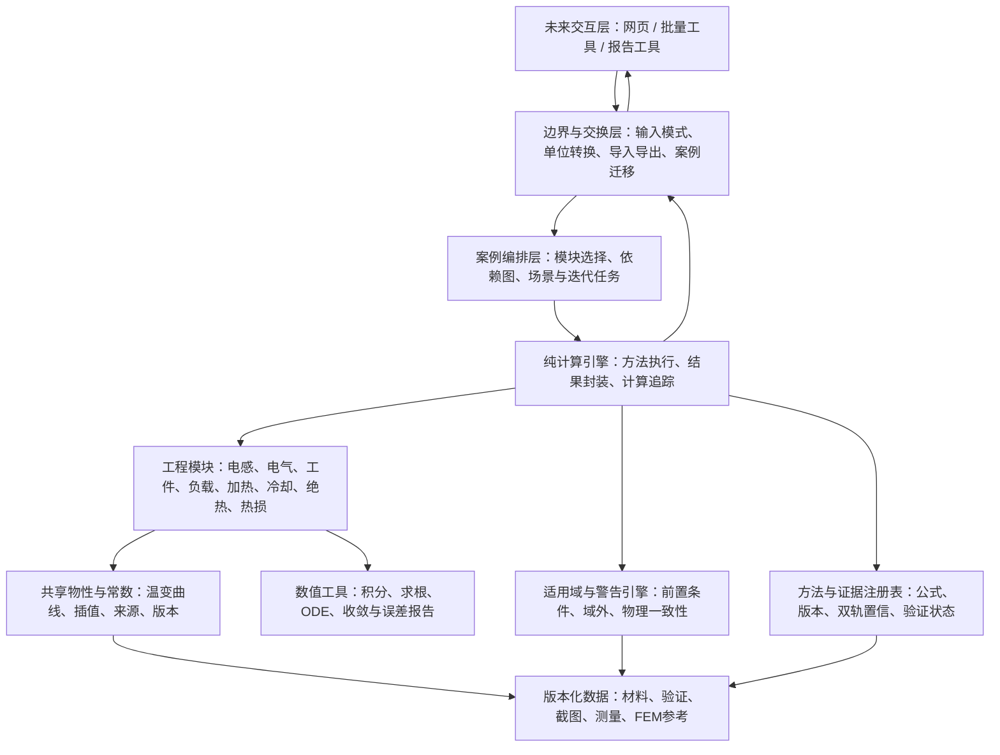
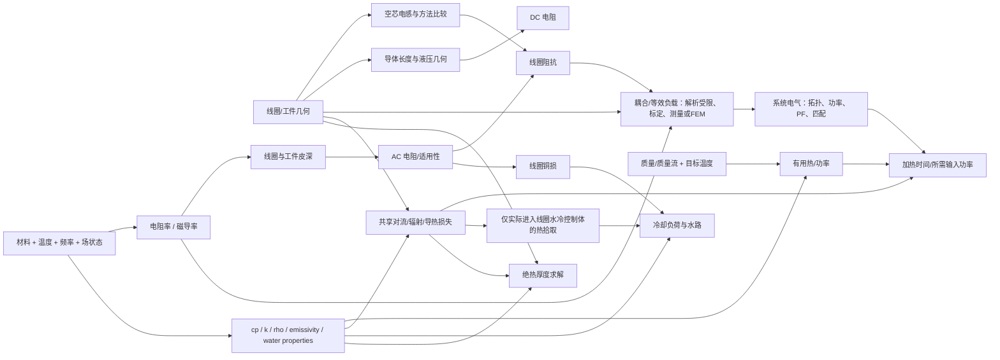
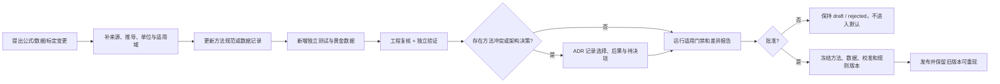

# 电磁感应加热工程计算器：未来应用架构

> 项目：Induction Heating Engineering Calculator / 电磁感应加热工程计算器  
> 文档状态：实施前架构提案，等待工程审阅  
> 日期：2026-08-13  
> 本阶段边界：只定义未来架构、接口责任、数据流和质量门禁；**不实现网站、不设计最终 UI、不选择 JavaScript 或其他框架。**

## 1. 架构结论

未来应用建议采用“**无界面的纯计算核心 + 独立工程数据层 + 方法/适用域注册表 + 案例编排层 + 可替换交互层**”的分层架构。

关键决策如下：

1. 所有计算逻辑与 UI、浏览器框架、图表库和文件格式分离。同一计算核心应能被未来网页、批量校核、测试和报告导出调用。
2. 计算核心内部只接受规范化 SI 数据；用户单位和历史工作簿单位只在边界层转换。公式内不允许隐藏换算常数。
3. 公式不是散落的函数集合。每个方法必须有稳定 `method_id`、版本、输入/输出、适用域、来源、假设、警告、验证用例和精度策略。
4. 材料物性只由共享属性服务提供，并锁定数据版本。模块不得各自维护铜、水、钢、绝热材料的冲突常数。
5. 每次计算都返回结构化结果包：数值、单位、方法版本、材料版本、适用域判定、警告、计算追踪、求解状态和双轨证据。不能只返回一个数字。
6. 电磁—温度、绝热—表面换热、流量—压降等循环关系由显式求解任务负责。普通模块依赖保持有向无环，不允许互相隐式调用直到“碰巧收敛”。
7. 遵循 ADR-0001 的双轨证据：`scientific_confidence` 与成熟软件截图复现置信度分别记录，绝不合并成一个总分。
8. 解析式、标定经验模型、数值积分、测量辨识和 FEM 参考是不同方法类别。它们可以比较，但不得互相冒充。
9. 历史工作簿和旧计算器是只读参考与回归线索，不是新计算核心的运行依赖。
10. 当前不锁定语言、前端框架、状态管理、数据库或部署方式；先批准计算依据、数据契约和测试门禁。

## 2. 架构目标与非目标

### 2.1 目标

- 让工程师能逐公式审阅、追溯和复算每个结果。
- 在同一规范化工况下比较 Wheeler、Nagaoka/Lundin、离散匝等不同方法。
- 对近似式、经验相关式和物性外推给出明确限制，不用虚假精度掩盖模型误差。
- 支持温变物性、插值、数值积分、非线性求根和瞬态能量方程。
- 支持成熟工程软件截图的黑箱复现，同时与物理可信度分栏评价。
- 支持保存、迁移、重算和差异比较设计案例。
- 支持未来网页之外的批量验证、命令行校核或报告生成，而不复制公式。
- 让方法、材料、校准参数和验证数据各自独立版本化，重现历史结果。

### 2.2 非目标

- 不把本应用建设成 Maxwell、ANSYS、COMSOL 的替代品。
- 不在应用内部实现通用二维/三维电磁有限元求解器。
- 不凭解析几何强行生成无法可靠预测的耦合系数、热态负载或局部热点。
- 不把串联、并联和 LLC 等不同电源拓扑压缩成一个“通用谐振公式”。
- 不把 FEM 图中的特定数值拟合成普适解析公式。
- 不在本阶段确定页面布局、颜色、控件、前端技术栈或部署平台。
- 不允许 UI、电子表格模板或导出报表成为计算真值来源。

## 3. 总体分层



### 3.1 层级责任

| 层 | 负责 | 不负责 |
|---|---|---|
| 交互层 | 收集用户选择、显示结果/追踪/警告、比较方法 | 公式、物性插值、单位常数、结果修正 |
| 边界与交换层 | 模式校验、显示单位↔SI、文件导入导出、旧案例迁移 | 工程公式和求解策略 |
| 案例编排层 | 建立依赖图、选择方法、锁定材料快照、组织显式耦合迭代 | 在自身复制模块公式 |
| 纯计算引擎 | 确定性执行、缓存安全的中间量、结果包、追踪和错误传播 | 页面状态、网络请求、文件系统副作用 |
| 工程模块 | 各自明确的物理/工程计算 | 私有材料常数、跨模块隐藏单位转换 |
| 物性与常数 | 版本化属性查询、插值、范围/来源/不确定度 | 选择某工程方法或自动掩盖缺失数据 |
| 警告引擎 | 输入合理性、方法适用域、求解状态、跨模块守恒检查 | 静默改写输入以得到“可用”结果 |
| 数值工具 | 通用积分、求根、插值、ODE、残差与收敛报告 | 决定某相关式是否适合当前物理问题 |
| 方法/证据注册表 | 方法元数据、来源、版本、置信、验证和生命周期 | 运行时猜测公式出处 |

## 4. 工程模块边界

### 4.1 Shared Material & Physical Properties

提供共享属性查询，不作为普通计算器页面的附属表。

- 工件：电阻率/电导率、磁导率或 B-H 数据、导热率、比热、密度、相变焓、Curie 温区。
- 铜：电阻率、导热率、比热、密度、热膨胀。
- 水：密度、比热、动力黏度、导热率、饱和温度—压力关系。
- 绝热材料：导热率随平均温度、湿度、密度和老化状态、最高使用温度。
- 表面：发射率随表面状态和温度。
- 共享常数：`mu0`、Stefan–Boltzmann 常数等，经批准后集中维护。

输出必须包含实际使用的数值、插值点、输入状态、来源版本、是否外推以及不确定度；不能只返回标量。

### 4.2 Coil Geometry & Inductance

负责几何标准化、理想长螺线管、Wheeler、Nagaoka/Lundin 电流片、离散匝互感和未来批准的有限截面方法。

- 统一平均电流路径半径、轴向绕组长度、节距、匝中心位置和导体截面定义。
- 默认物理基准与快速经验式分开。
- 少匝/粗管/大节距触发方法比较或测量/FEM建议。
- 不包含工件加载后的端口电感；该量属于等效负载模块。

### 4.3 Inductance Method Comparison & Validation

该模块是比较编排器，不另写电感公式。

- 对同一规范化几何和物性快照运行多个已注册方法。
- 显示绝对差、相对差、每种方法的适用域和证据类别。
- 计算 `b/D`、`p/d_c`、`N` 等无量纲比及警告。
- 不把任一方法自动标为“真值”；只有明确的测量、文献例或批准参考才可作为比较基准。

### 4.4 Coil Electrical Parameters

负责导体中心线长度、DC/AC 电阻、趋肤/邻近效应、铜损、电流密度、压降、反应性阻抗和 Q 定义。

- 实心圆线、空心圆管、矩形/方管采用不同几何策略。
- 接头、引线和母排为显式附加项。
- AC 电阻模型必须说明场方向、频率、皮深与壁厚/尺寸范围。
- 缺少可靠 proximity 模型时返回“未计入”警告或要求测量/FEM，不使用无来源倍数填空。

### 4.5 Workpiece Electromagnetic & Heating Parameters

负责工件皮深、频率—透入权衡、温变电磁属性和解析模型适用性。

- 内部统一 SI 皮深公式。
- `rho(T)`、`mu_r(H,T,f,state)` 的实际取值由物性服务提供。
- Curie 过渡、磁饱和、薄壁、端部和异形几何触发强警告。
- “临界频率”必须携带其经验定义和几何范围，不能显示为材料常数。

### 4.6 Coil–Workpiece / Equivalent Load

负责明确拓扑下的反射阻抗代数、端口参数辨识和模型/测量结果封装。

- 可直接计算：给定 `M,R2,L2` 后的理想变压器反射项；给定同频端口量后的串联或并联等效辨识。
- 不可凭空直接计算：一般几何的 `k/M`、复杂工件热态 `Req/Leq`、局部吸收功率分布。
- 数据来源可为解析受限模型、标定经验模型、阻抗测量或外部 FEM 参考，并必须明示。
- `Leq/L0` 不自动命名为耦合系数。

### 4.7 Heating & System Electrical

负责批次/连续物料有用热、加热时间、功率边界、效率链和明确电源拓扑。

- 批次能量、连续质量流、温变 `cp`、相变/反应分别建模。
- 网侧、逆变器、线圈端、工件吸收、有用热、铜损和环境热损使用不同变量。
- 普通串联、普通并联、LLC 各自独立子模型；拓扑未知时不计算谐振电容。
- 瞬态强非线性时调用能量 ODE，而不是给出伪精确 `mc_pΔT/P`。

### 4.8 Cooling Water

负责冷却热负荷分解、流量、支路速度、Re、平均水侧换热和条件充分时的压降。

- 总热负荷中的铜损、热拾取、磁性元件和其他水冷项分别标记来源。
- 多支路是否均分必须由几何/管网假设或实测支持。
- 速度范围、水质、压差、沸腾余量在取得权威依据前不显示为已批准“合格区”。
- 局部铜温和汽膜风险不能由平均流量单独保证。

### 4.9 Thermal Insulation Thickness

负责两个独立设计问题：目标外表面温度与目标热损上限。

- 使用圆筒分层热阻和外表面对流+辐射闭合求解。
- 两个约束同时给出时分别求解，取满足两者的厚度并重新校核。
- 平壁简化、临界绝热半径和标准公式需带几何与标准状态标签。
- 标准正文存在疑似量纲/印刷问题时采用经批准的独立推导，并保留待勘误状态。

### 4.10 Shared Thermal Loss Components

提供可复用的对流、辐射、圆筒导热、端部/热桥占位和稳态/瞬态热损组件。

- 统一温度、面积和热流基准。
- 辐射一律使用 K。
- 相关式选择必须记录姿态、特征长度、Re/Gr/Ra/Pr 及范围。
- 各模块通过该组件引用热损，禁止复制一套略有差异的公式。

### 4.11 Case Orchestration & Balance Checks

该模块只组织计算，不新增物理公式：

- 建立工况依赖图并锁定所有输入/物性/方法版本。
- 运行功率平衡、能量平衡、量纲和被动性等跨模块检查。
- 对显式耦合问题组织迭代并报告残差。
- 汇总结果、警告和证据，不替下游模块“修正”不一致结果。

## 5. 方法分类与方法注册表

### 5.1 方法类别

方法与结果状态统一引用 `docs/METHOD_STATUS_DICTIONARY.md`；本节只列机器值，不另造同义枚举。

| `method_class` | 含义 | 可作默认结果的条件 |
|---|---|---|
| `analytical` | 闭式解析、恒等式或可验证推导 | 来源/推导、适用域和验证均通过 |
| `engineering_correlation` | 有明确来源和验证范围的工程相关式 | 当前工况在原验证域，且显示近似性质 |
| `calibrated_engineering_model` | 为复现成熟软件或项目数据而标定 | 校准集和独立留出集冻结；只在批准包络内 |
| `numerical` | 数值积分、求根、ODE 或离散互感等 | 基础物理模型成立，且给出收敛/残差/误差 |
| `measurement_identified` | 由同频电压、电流、功率、阻抗等测量辨识 | 仪器、夹具、去嵌入、温度和不确定度完整 |
| `fem_or_experiment_reference` | 外部 FEM/多物理场或独立试验参考结果 | 只对已记录几何、边界、网格、仪器与材料模型有效 |

`fem_or_experiment_reference` 是导入和比较数据，不代表本应用内置 FEM；不得把外部 FEM/实测结果改写成解析真值。

### 5.2 每个方法的最小元数据

每个可运行方法至少记录：

| 字段 | 要求 |
|---|---|
| 标识 | 稳定 `method_id`、语义版本、模块、生命周期状态 |
| 工程问题 | Purpose、所回答的问题、不能回答的问题 |
| 输入/输出 | 参数标识、符号、维度、SI 单位、必填性、合理范围 |
| 公式与序列 | 公式 ID、符号式、执行顺序、依赖和原单位形式 |
| 假设/适用域 | 几何、材料、频率、温度、流态、拓扑、边界条件 |
| 数值策略 | 求解器、容差意义、最大迭代、失败规则 |
| 证据 | 一手来源页码/式号、独立推导、校准或测量数据集 |
| 双轨置信 | 科学依据与成熟软件复现分别记录，见第 6 节 |
| 验证 | 文献例、极限例、黄金数据、留出集、测量/FEM对照 |
| 精度策略 | 不确定度、有效数字、舍入依据、已知偏差 |
| 警告 | 稳定警告代码、触发谓词、用户行动建议 |
| 审批 | 起草、复核、批准人/日期、替代或废止关系 |

方法定义应是可审查的工程规范；运行实现只是它的一个受控实现。改变公式、变量定义、默认物性、适用域或标定参数时必须升方法版本。

## 6. 双轨证据与置信模型

ADR-0001 当前为“拟议”。本架构按其方向设计，但是否正式采用仍需工程批准。

### 6.1 两个独立对象

1. `scientific_confidence`
   - 评价一手来源、量纲、推导、假设、适用域、独立数值复算和实验/FEM证据。
   - 候选机器状态统一见数据字典：`high`、`engineering_approximation`、`needs_verification`、`fem_or_experiment_recommended`、`rejected`；`reference_only` 属于工程批准/生命周期状态，不混入科学置信枚举。
   - 必须附理由和证据，不只是枚举标签。

2. `black_box_reproduction_confidence`
   - 面向用户所说的“成熟工程软件截图复现置信度”；字段名沿用 ADR-0001，未来显示名称可用“成熟软件复现”。
   - 候选机器状态统一为：`none`、`hypothesis_single_case`、`multi_case_calibration`、`holdout_validated`、`out_of_domain`。
   - 必须保存目标软件/版本、输入字段定义、校准集、密封留出集、输入包络、误差指标、显示舍入和参数版本。

两个对象不得求平均、相乘或折算为一个“综合可信度”。可能出现：

- 科学置信高、尚无截图复现数据；
- 科学置信低，但在已批准包络内高质量复现成熟软件；
- 两轨均高；
- 两轨均不足。

### 6.2 成熟软件复现的最低要求

当前已读取的截图、工作簿和主线程转录值全部已经暴露给历史建模过程，统一标 `historical_exposed_reference`；它们可作校准候选和回归参考，不能再升级为密封留出。真正 `holdout_validated` 只能使用模型结构、特征和阈值冻结后取得的新工况。

- 校准案例与留出案例严格区分；同一输出的代数派生列不算独立验证。
- 工况覆盖相关维度，例如 `b/D`、匝数、节距/导体尺寸、频率、间隙、材料和温度。
- 每个输出报告带符号误差、绝对误差、相对误差、最大误差和样本数；接近零时不用相对误差。
- 记录成熟软件显示分辨率，误差不能声称优于截图舍入范围。
- 输入超出校准包络时，状态变为 `out_of_domain`，禁止静默外推或至少给出强警告。
- 单工况反算的常数只能是 `hypothesis_single_case`。
- `Req=P/I²`、`Leq=QReq/omega` 等恒等式复现只证明内部一致性，不证明几何正向模型。

### 6.3 结果展示规则

未来结果包应并列显示：

- 物理/科学方法结果与置信；
- 成熟软件兼容/校准模型结果与复现误差；
- 两者差值及适用域；
- 测量或 FEM 参考（若有）。

当两轨冲突时不静默择一。默认结果采用哪一轨是需要审批的产品决策，且不同模块可能不同。

## 7. 统一工程数据模型

### 7.1 量值

所有量值在边界后至少包含：

| 项 | 含义 |
|---|---|
| `parameter_id` | 稳定工程参数标识，不依赖页面中文标签 |
| `value_si` | 规范化 SI 数值或数组 |
| `dimension` | 长度、温度、功率、电阻率等维度标识 |
| `input_unit` | 用户原始单位，用于追踪和无损回显 |
| `source_kind` | user、derived、material、measurement、calibration、default |
| `source_ref` | 原输入、公式节点、材料属性或数据集引用 |
| `uncertainty` | 若已知，记录类型、范围和置信水平 |
| `status` | known、estimated、missing、not_applicable |

内部温度建议统一 K；摄氏温差可在量纲明确时换算，但辐射节点只接受绝对温度。

### 7.2 材料与属性记录

材料记录应支持复合状态，而不是一个“钢材名称→常数表”：

| 字段组 | 内容 |
|---|---|
| 身份 | `material_id`、牌号、标准、批次/状态、修订 |
| 属性 | `property_id`、`value_kind = constant/function/table`、SI 单位 |
| 自变量 | `T,f,H/B,phase/state,moisture,pressure,density/aging` 中适用项 |
| 数据 | 表格点或批准方程、测量条件、不确定度 |
| 有效域 | 每个自变量上下界、相变/Curie 分段 |
| 插值 | 线性、对数、单调样条或经批准方法；不得运行时猜测 |
| 外推 | `forbid`、`warn` 或特批模型 |
| 来源 | 文档、页码/表/式、数字化方法、许可与校核状态 |
| 生命周期 | draft、reviewed、approved、deprecated、rejected |

属性查询返回“属性快照”，其中保存实际插值邻点、插值方法、状态、外推距离和版本。跨 Curie/相变不允许一条未审查多项式平滑掩盖物理变化。

### 7.3 方法输入与结果包

方法调用只接受经过模式和量纲验证的 SI 输入、材料属性快照及显式求解设置。结果包至少包含：

- `result_status`：success、success_with_warnings、not_applicable、insufficient_data、non_converged、invalid_input；
- 输出量及不确定度/有效数字建议；
- 方法、引擎、材料和数据集版本；
- 适用域检查清单；
- 稳定警告代码；
- 结构化计算追踪；
- 数值求解报告；
- 双轨置信快照；
- 输入与结果摘要哈希，供重现和审计。

`not_applicable`、`insufficient_data` 与数值零完全不同，禁止用 `0`、空白或 `NaN` 代替工程状态。

### 7.4 设计案例

保存案例应包含：

- 案例 ID、标题、说明、模式版本和创建/修改时间；
- 原始输入值及原单位、规范化 SI 快照；
- 选定的模块、方法和电源拓扑；
- 材料、属性曲线、常数、标定参数、验证数据版本；
- 求解器设置和收敛要求；
- 结果、追踪、警告和双轨证据快照；
- 附件清单及哈希，例如截图、测量报告或 FEM 导出；
- 审批/签字状态和备注。

保存案例默认不可在原地悄悄改变历史结果。新引擎或数据版本重算时产生新运行记录，并提供旧—新差异报告。

## 8. 单位架构

### 8.1 原则

- 计算核心只使用 SI：m、kg、s、A、K、Pa、W、J、Ω 及其导出单位。
- UI 或导入边界允许 mm、cm、inch、µH、kW、L/min、µΩ·cm 等工程单位。
- 每个输入必须携带单位；裸数字不得跨边界进入计算核心。
- 原文英寸/微亨公式可为追溯保留，但实现入口先显式转换，结果再转换回 SI。
- 单位转换由集中注册表完成，模块不得出现散落的 `25.4`、`1e-6`、`60` 等隐藏换算。
- 温度值与温差是不同量纲语义；℃ 到 K 的偏移只适用于温度值。
- 面热流、线热流和总热量分别建模，面积基准随几何变化时必须明示。

### 8.2 边界流程

`原始值 + 单位 → 模式校验 → 维度校验 → SI 规范化 → 计算 → SI 结果 → 显示单位转换`。

导出应同时保留规范 SI 和显示单位；导入时若单位缺失、歧义或字段定义与版本不符，阻止自动计算并要求映射确认。

## 9. 依赖图与计算阶段

### 9.1 工程依赖图



图中的 `LOAD` 不表示所有工况都能解析预测。它是一个来源明确的结果接口，可来自测量、标定或外部 FEM。

### 9.2 计算阶段

1. **输入冻结**：校验模式、单位、几何定义、拓扑和必要来源。
2. **属性快照**：在指定 `T,f,H/state` 下取得材料属性；所有后续模块共享同一快照或由显式迭代更新。
3. **几何与无量纲量**：生成标准化几何、面积、长度、`b/D`、`p/d_c` 等。
4. **电磁/电感**：运行选定方法和适用域检查。
5. **线圈电气与负载**：计算可防御的阻抗项，或接入测量/标定/FEM参考。
6. **系统电气与有用热**：按明确边界和拓扑建立功率链。
7. **热损、绝热和冷却**：使用共享热损与水物性。
8. **显式耦合迭代**：若温度改变物性或表面温度未知，由求解任务迭代；记录每步残差。
9. **跨模块校核**：功率/能量守恒、被动性、量纲、结果数量级和域外检查。
10. **结果封装**：输出版本、追踪、警告、置信和有效数字。

## 10. 显式耦合与循环依赖管理

普通模块应构成 DAG。确需反馈时，由专门“求解场景”声明状态变量和残差：

| 场景 | 状态变量示例 | 残差/闭合条件 |
|---|---|---|
| 温变电磁负载 | 工件温度或温区、`rho(T),mu(T)`、`Req/Leq` | 每步温度/功率变化与时间积分残差 |
| 绝热厚度 | 外半径、表面温度、层间温度 | 径向导热 = 对流 + 辐射；目标约束满足 |
| 冷却局部温度 | 流量、物性、平均/局部壁温 | 水侧能量、换热、压降和管网平衡 |
| 系统功率选型 | 吸收功率、铜损、热损、效率 | 各边界有功平衡；不得把无功计入热损 |

求解任务必须声明初值、括区/步长、容差、最大迭代、松弛策略和失败规则。收敛失败时返回 `non_converged` 与最后残差，不返回普通成功数值。

## 11. 数值求解与插值工具

### 11.1 工具范围

- 一维有界求根：优先有括区的稳健方法，用于绝热厚度和表面温度。
- 数值积分：物性焓积分、椭圆积分或其他经批准积分；支持收敛加密检查。
- 表格插值：按材料属性元数据指定方法，并保护相变/Curie 分段。
- 常微分方程：温变物性和热损下的加热过程。
- 非线性/耦合迭代：只有在残差和变量明确时使用。
- 不确定度/敏感性：首版至少支持关键输入扰动和方法差异报告；概率模型待独立批准。

### 11.2 求解报告

每次数值任务返回：

- 算法 ID/版本；
- 初始区间或初值；
- 绝对/相对容差及工程含义；
- 迭代次数、函数评估次数；
- 最终残差、括区宽度或步长误差估计；
- 是否命中最大迭代、边界或非物理状态；
- 所有警告和最后可诊断状态。

容差不能远小于输入物性和模型不确定度后再据此显示更多有效数字。Simpson 分段数增加只能证明数值积分收敛，不证明物理模型更准确。

## 12. 适用域、校验和警告引擎

### 12.1 校验阶段

1. **模式/单位校验**：字段存在、类型、维度、单位和版本。
2. **物理输入校验**：正长度、非负损耗、绝对温度、材料状态等。
3. **方法前置条件**：几何比、Re/Pr/Ra、频率、壁厚、拓扑等适用域。
4. **求解过程检查**：属性外推、无根、残差、非物理中间状态。
5. **结果后置条件**：被动网络 `R>=0`、效率边界、能量守恒、数量级。
6. **跨模块一致性**：同一功率边界、同一材料快照、同一 RMS/峰值定义。

### 12.2 稳定警告对象

每条警告包含：

- 稳定代码和版本；
- 严重度：`info`、`caution`、`warning`、`blocking`；
- 触发的实际值、阈值和比较方式；
- 阈值来源或“项目待审批规则”；
- 受影响的输入、方法、输出和追踪节点；
- 对结果的影响；
- 建议行动，例如补数据、换方法、测量、FEM或实验。

警告阈值不得散落在 UI 文本中。未经批准的 3% 方法差、冷却速度带等只能标为草案规则，不能显示成标准限值。

### 12.3 失败语义

- `invalid_input`：输入本身不成立，阻止执行。
- `not_applicable`：方法不适用于当前工况；可运行其他方法。
- `insufficient_data`：缺少必要物性、拓扑或测量，不猜值补齐。
- `non_converged`：数值任务失败；保留诊断，不给普通结果。
- `success_with_warnings`：有可解释结果，但必须显示限制。
- `success`：通过当前全部已批准检查；不等于无限适用或实验认证。

## 13. 结构化计算追踪

计算追踪应由引擎自动生成，不能仿照旧工作簿人工复制一张“逐步过程”表。

每个追踪节点至少包含：

- 节点 ID、公式/方法 ID 与版本；
- 工程目的与符号方程；
- 解析来源、页码/式号或推导引用；
- 输入 SI 数值、原单位和来源节点；
- 使用的材料值、插值点、属性版本；
- 中间量与输出 SI 数值；
- 单位/量纲检查；
- 假设与适用域结果；
- 数值算法、残差和误差；
- 警告、置信和有效数字建议。

追踪本质上是结果依赖图。未来 UI 可把它渲染成简洁步骤或完整推导，导出器可生成 Markdown/PDF/JSON；计算核不应只拼接不可解析的说明字符串。

## 14. 方法比较

比较服务的输入必须是同一个已冻结案例和物性快照。它负责：

- 运行多个候选方法，不重新解释字段或单位；
- 显示每个方法的结果、状态、适用域、方法类别和双轨置信；
- 计算绝对差、带符号相对差、相对选定参考的误差；
- 将数值误差、模型差和输入/物性不确定度分开；
- 按无量纲几何比组织扫描，例如 `b/D`、`p/d_c`、`delta/t`；
- 保留“不适用/数据不足”，不从图表中悄悄删除失败方法。

参考值只可由用户或批准的验证用例指定为：解析极限、原论文例、测量、外部 FEM 或成熟软件截图。方法之间互相接近不是独立验证。

## 15. 保存案例、导入和导出

### 15.1 规范交换格式

未来应定义一个版本化、可机读的规范案例格式。首要要求是语义和可迁移性，不在本阶段锁定数据库或具体序列化库。

规范格式需要：

- 模式版本和迁移记录；
- 原始单位值与 SI 值；
- 引擎、方法、材料、校准参数和数据集版本；
- 完整结果、警告、追踪和求解报告；
- 证据引用、附件哈希和审批状态。

### 15.2 导入

- 导入历史 Excel 时使用独立映射清单，明确工作表/单元格、单位、字段定义和已知错误。
- 不执行导入文件中的宏、脚本或未审查公式。
- 工作簿缓存结果只作历史/黑箱数据，不自动成为黄金真值。
- 单位缺失、内外径/平均直径歧义、线圈长度定义不明时要求人工确认。
- 对旧模式执行显式迁移；无法无损迁移时保留原文件并报告缺口。

### 15.3 导出

按用途可提供：

- 规范案例包：完整可重算数据；
- 人类审阅报告：输入、结果、追踪、警告、证据和版本；
- 表格导出：参数扫描和方法比较；
- 验证包：输入、预期输出、容差、来源和结果差异。

任何导出都必须注明结果不是 FEM、是否为标定模型、是否域外、所用物性/方法版本和未计入项。

## 16. 版本与可重现性

以下版本必须分开，不能只记录一个“应用版本”：

- `case_schema_version`：案例/交换格式；
- `engine_version`：编排和公共计算引擎；
- `method_id + method_version`：每个工程方法；
- `material_dataset_version`：材料/属性库；
- `constant_set_version`：共享常数；
- `calibration_model_version`：参数、训练集与留出集；
- `validation_dataset_version`：黄金数据和参考来源；
- `warning_rules_version`：适用域和项目门槛；
- `solver_version/settings`：数值算法及容差；
- `architecture/basis_revision`：批准的架构与计算依据。

同一输入、同一全部版本和同一求解设置应给出可重现结果。若底层数学库或平台导致差异，必须在测试容差内并记录运行环境；不得用自动更新的在线材料值破坏历史重现。

## 17. 建议目录结构

以下是未来实施时的逻辑结构提案；**本阶段不要求创建这些源代码子目录。**

```text
Induction_Heating_Engineering_Calculator/
├─ CALCULATION_BASIS.md
├─ CALCULATION_CONTRACTS.md
├─ FORMULA_SOURCE_REGISTER.md
├─ APPLICATION_ARCHITECTURE.md
├─ PROJECT_AUDIT.md
├─ VALIDATION_CASES.md
├─ docs/
│  ├─ decisions/                 # ADR 与审批决定
│  ├─ methods/                   # 方法规范、公式与适用域
│  ├─ data-dictionary/           # 参数、单位、功率边界、拓扑字典
│  └─ release-notes/             # 方法/数据/结果变化说明
├─ data/
│  ├─ constants/                 # 经批准常数集
│  ├─ materials/
│  │  ├─ candidate/              # 待审物性
│  │  └─ approved/               # 批准且版本化物性
│  ├─ calibration/               # 标定参数、校准集与密封留出集
│  ├─ schemas/                   # 案例、材料、方法、结果契约
│  └─ validation/                # 可机读黄金数据与来源元数据
├─ references/                   # 原始来源、工作簿、旧原型，只读保全
├─ validation/
│  ├─ protocols/                 # 测量/FEM/文献复算协议
│  ├─ results/                   # 审批过的验证报告和差异报告
│  └─ review/                    # 待工程签字材料
├─ src/                          # 未来实现；当前保持空置
│  ├─ domain/                    # 参数、量值、案例、结果等领域对象
│  ├─ units/                     # SI 边界与量纲
│  ├─ properties/                # 物性查询与插值
│  ├─ methods/                   # 方法注册与纯公式实现
│  ├─ modules/                   # 电感、电气、工件、负载、热工等
│  ├─ numerics/                  # 通用数值工具
│  ├─ validation/                # 警告和适用域规则
│  ├─ orchestration/             # DAG、耦合求解与案例运行
│  ├─ trace/                     # 结构化计算追踪
│  ├─ interchange/               # 导入、导出和模式迁移
│  └─ ui-adapter/                # 未来 UI 适配；不得含公式
├─ tests/                        # 未来测试；当前保持空置
│  ├─ units-and-dimensions/
│  ├─ formulas/
│  ├─ properties/
│  ├─ numerics/
│  ├─ applicability-warnings/
│  ├─ limiting-cases/
│  ├─ literature-golden/
│  ├─ mature-software-reproduction/
│  ├─ measurement-fem-reference/
│  ├─ cross-module-balances/
│  └─ serialization-migrations/
├─ exports/                      # 生成物，不作权威输入
├─ working/                      # 审计中间资料，不作批准依据
└─ archive/                      # 废止但可追溯版本
```

`data/validation/` 存机器可读基准；`validation/` 存验证方案、签字报告和差异审阅。二者不能被一次测试运行自动覆盖。

## 18. 测试结构

### 18.1 测试类别

| 类别 | 目的 |
|---|---|
| 单位/量纲 | 验证 SI 包装、温度/温差、原单位与换算；捕获工作簿式量纲错 |
| 公式单元 | 逐公式与手算/高精度参考一致，不依赖 UI |
| 属性数据 | 插值、分段、外推、Curie/相变边界和来源版本 |
| 数值算法 | 已知根/积分/ODE、收敛加密、失败状态和残差 |
| 极限情形 | 长螺线管、单匝、薄/厚皮深、无辐射、零风速等物理极限 |
| 文献黄金数据 | Wheeler、Lundin、Rosa/Grover、标准/教材算例及页码 |
| 成熟软件复现 | 校准集与密封留出集分离；逐输出误差和输入包络 |
| 测量/FEM参考 | 同几何、材料、频率、边界下比较；不跨案例外推 |
| 方法比较 | 验证同一规范输入、差值方向、失败方法不被隐藏 |
| 跨模块守恒 | 功率、能量、流量、被动性和功率边界 |
| 警告覆盖 | 每个批准适用域边界的内/边界/外三类测试 |
| 序列化/迁移 | 保存—读取不丢语义；旧案例迁移和结果差异可审计 |
| 确定性 | 同版本/输入/设置重复运行结果一致 |

### 18.2 黄金数据规则

- 黄金值必须有来源、页码/式号、输入单位、预期值、容差和容差依据。
- 黄金文件不得由被测试实现自动重写。
- 结果变化时生成差异报告，不以“更新快照”消除失败。
- 文献排版/OCR 有疑点时，先视觉核验和独立推导；未解决前状态为 candidate。
- 工作簿/截图结果应放入成熟软件复现数据集，不与文献/实验黄金值混为一类。
- FEM 基准记录软件版本、网格、边界、材料曲线和收敛证据。
- 测量基准记录仪器、校准、夹具去嵌入、RMS/基波、温度与不确定度。

## 19. 实施与发布测试门禁

阈值数值尚需工程批准；以下定义门禁内容，不预设通过标准。

### Gate 0：计算依据完整

- Purpose、输入、输出、公式、单位、假设、适用域、序列、依赖、警告和验证案例完整。
- 一手出处或独立推导可追踪。
- 已知冲突和拒用项明确。

### Gate 1：实现忠实与量纲正确

- 纯计算实现与批准公式逐项对照。
- SI 边界、半径/直径、峰值/RMS、串/并联等效测试通过。
- 无隐藏单位常数、UI 公式或全局可变默认值。

### Gate 2：科学验证

- 解析极限、文献黄金值和独立复算通过。
- 数值收敛和适用域边界有测试。
- 科学置信标签与证据一致。

### Gate 3：成熟软件复现

- 仅适用于声称“兼容/复现”的方法。
- 校准与留出数据冻结，字段映射和软件版本明确。
- 留出误差达到批准阈值，且没有明显域内系统性偏差。
- 复现置信不被写成物理验证。

### Gate 4：系统一致性

- 功率/能量/流量平衡和拓扑边界通过。
- 跨模块共享相同物性和几何定义。
- 耦合循环由显式求解器收敛并报告残差。

### Gate 5：警告与失败安全

- 域外、外推、数据不足、非收敛和拓扑未知均有预期状态。
- 阻断条件不会被默认值绕过。
- 结果有效数字不超过证据、输入和模型允许程度。

### Gate 6：重现与迁移

- 保存案例锁定所有版本并可重算。
- 模式迁移有测试和差异报告。
- 黄金数据、批准物性和校准留出集不可被运行时修改。

只有所需门禁全部通过，某一方法/数据版本才可进入“approved for engineering calculation”。应用整体发布不能自动替尚未批准的方法背书。

## 20. 变更、版本和审批流程



### 20.1 生命周期

建议统一状态：`draft → reviewed → approved → deprecated → retired`，另有 `rejected`。只有 `approved` 可作为正常默认候选；`deprecated` 仍可为历史案例重算，但新案例不默认选择。

### 20.2 需要升版本的变化

- 公式或算法改变；
- 变量定义、半径/直径、轴向长度、单位或功率边界改变；
- 适用域、警告或失败策略改变；
- 默认物性、插值或外推改变；
- 标定参数、校准/留出数据集改变；
- 数值容差改变到足以影响工程结果；
- 修复曾产生错误结果的实现缺陷。

所有变化都应对已批准代表案例批量重算，输出旧—新差异及原因。不能只写“精度优化”。

### 20.3 审批角色

具体人员待项目确定，但角色应分离：

- 计算依据负责人：批准物理模型、变量和适用域；
- 来源/数据复核人：核对文献页、单位、材料数据和版本；
- 独立验证人：不使用实现输出生成黄金值；
- 软件实现人：证明实现忠实和测试完整，不单独批准工程正确性；
- 产品/项目批准人：决定默认方法、兼容模式和用户警告政策。

标定经验模型还需数据负责人冻结校准/留出划分，防止验证集泄漏。

## 21. 旧工作簿与旧原型的接入策略

- 原件保留在 `references/`，只读、有哈希和来源清单。
- 建立显式字段映射和已知错误表，例如 `l/Dm` 反向、Nagaoka 双乘、cm/mm 混用、质量流量误标速度等。
- 有价值的截图公式逐条拆分：基础物理式进入候选方法；无来源但可稳定复现者进入 `calibrated_engineering_model`；已证量纲/逻辑错误者进入拒用清单。
- 旧计算器 UX 只能提供交互启发，不决定新计算内核架构。
- 不在新核心中保留“为了复现单张截图”而写死的常数；若项目需要兼容，应使用独立、版本化、域受限的校准模型。
- 新引擎可生成旧案例比较报告，但不得回写或修改源工作簿。

## 22. 架构反模式

以下做法应在代码审查和工程审查中直接阻止：

- 在页面事件、表格公式或报告模板中实现工程公式；
- 各模块自行定义水、铜、钢或发射率默认值；
- 用裸 `number` 传递没有单位/维度的跨模块输入；
- 将空白或缺失属性静默当作零；
- 材料表静默外推，尤其跨 Curie 或相变；
- 根据结果“调系数”后用同一案例宣称验证；
- 把数值收敛误称物理准确；
- 把方法之间接近误称实验验证；
- 把无功功率作为热损，或混用网侧/线圈端/工件吸收边界；
- 未知拓扑时计算谐振电容；
- 把 `Leq/L0` 自动解释成耦合系数；
- 将 FEM 个案值写入通用公式；
- 自动刷新在线数据导致历史案例不可重现；
- 测试失败后无审查地更新黄金快照；
- 返回伪精确小数而不显示方法限制和输入不确定度。

## 23. 建议的实施顺序（批准后）

本节只说明未来顺序，不授权开始编码：

1. 批准 `CALCULATION_BASIS.md`、参数字典、功率边界、方法分类和 ADR-0001。
2. 批准案例、量值、材料、方法、结果、警告和追踪的数据契约。
3. 建立单位/量纲、共享常数、物性和数值工具的独立验证规格。
4. 先实现低耦合、高置信模块，例如几何、SI 皮深、DC 电阻、Lundin/Nagaoka、基本热阻/能量平衡。
5. 用文献黄金值和极限案例通过 Gate 0–2，不接 UI。
6. 将现有成熟软件截图建立为“历史已暴露/校准候选”数据集；模型冻结后另取得新截图并密封为留出，单独开发兼容经验模型。
7. 接入测量/FEM参考和跨模块功率/热平衡。
8. 最后再选择 UI 技术和构建交互层；UI 只消费稳定契约。

## 24. Engineering Decisions Requiring Approval Before Implementation

1. 是否批准 ADR-0001 的双轨证据原则，以及沿用字段名 `black_box_reproduction_confidence` 作为“成熟软件截图复现置信度”。
2. 各模块的默认物理方法与“软件兼容/校准模型”是否并列显示，哪个可作为默认主结果。
3. `scientific_confidence`、复现置信和方法生命周期的正式枚举与审批责任人。
4. 成熟软件校准集/留出集的构成、输入包络、误差指标和验收阈值。
5. 线圈平均直径、轴向绕组长度、节距和导体截面的统一项目定义。
6. 方法差、皮深/壁厚、冷却速度、数值残差等警告阈值；未经批准前保持草案。
7. 首批批准材料与物性来源、插值/外推政策、Curie/相变分段方式。
8. `Req/Leq/k` 首版是否限定为测量/标定输入与端口辨识，不承诺一般几何正向预测。
9. 首批支持的电源拓扑；串联、并联、LLC 的独立范围和 RMS/基波定义。
10. 绝热标准疑似公式错误的处理：是否正式采用独立 Fourier/能量平衡推导并等待官方勘误。
11. 冷却水速度、水质、压差、沸腾余量和管材冲蚀依据；在批准前不显示合格判据。
12. 案例交换格式、版本策略、长期存储方式和附件保全要求。
13. 黄金数据变更、材料数据发布、方法升级和工程签字的正式门禁流程。
14. 有效数字与不确定度策略：各类结果允许显示的精度及域外结果的阻断/警告规则。
15. 未来 UI/技术栈的选择时点；建议只在计算契约和核心门禁通过后单独决策。

---

## 25. 本文依据与状态说明

本架构提案依据：

- `docs/decisions/ADR-0001-dual-track-evidence.md`；
- `working/EM_LITERATURE_AUDIT.md`；
- `working/THERMAL_SYSTEM_LITERATURE_AUDIT.md`；
- `working/WORKBOOK_FORENSIC_AUDIT.md`；
- 项目 `README.md` 的当前阶段与目录约束。

这些审计揭示的公式冲突和未决问题不会因本架构文档而自动获批。`APPLICATION_ARCHITECTURE.md` 只规定未来软件如何隔离、追溯、验证和呈现计算；最终实现必须等待 `CALCULATION_BASIS.md` 和上述工程决定明确批准。
