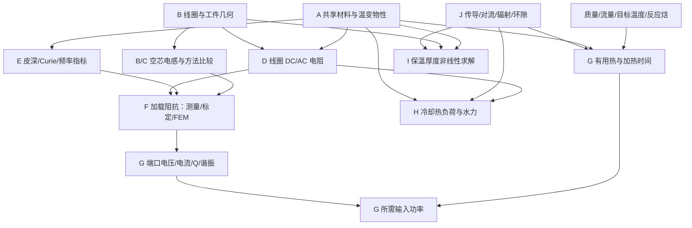

# Induction Heating Engineering Calculator — Calculation Basis

> 中文名称：电磁感应加热工程计算器计算依据  
> 状态：工程审查草案，**未批准实施**  
> 版本：0.1，2026-08-13  
> 本阶段边界：只定义计算、证据、验证与警告；不实现网站，不确定前端框架。

## 1. 目的与批准边界

本文是未来计算器唯一的主计算技术规范。任何进入实现的公式必须在本文中具有：目的、输入、输出、SI 方程、假设、适用域、执行顺序、依赖、警告、验证案例和来源状态。为控制篇幅，短小的定义式可能把这些字段合并在一段或表格中；字段没有明确记录就表示该方法尚未获实施批准，而不是允许实现者自行补猜。

截至 v0.1，本文 52 个编号条目是**工程方法清单与依据骨架**，不是 52 个均已冻结的方法。52/52 逐条计算契约已经汇编至 `CALCULATION_CONTRACTS.md`；只有其中 `approval_status`、输入域、依赖、来源和验证容差全部通过后，相关条目才可从 `draft/not_approved` 升级。当前多数条目仍明确未批准，因此 Gate 0 尚未通过；不以文档齐全或公式存在掩盖。

本文不把旧聊天、旧 Excel、成熟软件截图或 FEM 自动视为通用物理定律；也不因截图反推不是严格推导而放弃它的工程价值。项目采用双轨评价：

**裁决原则：**工作簿单元格、截图输出、师傅批注、旧模型结论和项目论文中的现成表格均只构成候选证据，不构成批准本身。最终采用与否由本项目的独立分析决定：一手来源/可复核推导、SI 量纲、边界条件、极限趋势、跨工况验证和不确定度必须共同闭合。即使某表格与截图完全一致，也只能证明复现能力；若物理链未闭合，仍不得进入工程物理默认结果。

| 评价轴 | 含义 | 典型证据 |
|---|---|---|
| `scientific_confidence` | 来源、量纲、边界条件和独立推导的可信度 | 原始论文、标准、官方物性、解析极限、实验 |
| `black_box_reproduction_confidence` | 对成熟工程软件多个截图工况的复现能力 | 独立截图输入/输出、留出工况残差 |

方法类型、批准状态、结果血缘、双轨置信度和警告严重度的唯一候选机器值见 `docs/METHOD_STATUS_DICTIONARY.md`。可接受的方法类型：

- `analytical`：解析或闭式工程计算；
- `engineering_correlation`：有明确试验范围的经验相关式；
- `calibrated_engineering_model`：由成熟软件/本项目实测标定，只能在校准包络内使用；
- `numerical`：数值积分、求根或 ODE；
- `measurement_identified`：由端口测量辨识参数；
- `fem_or_experiment_reference`：用于验证，不伪装成通用解析式。

单点反推只允许标为 `hypothesis`。由 `P=I²R`、`Q=ωL/R` 等恒等式反算得到的结果，只证明输出内部自洽，不证明“几何与材料已正向预测”。双轨决策详见 `docs/decisions/ADR-0001-dual-track-evidence.md`。

## 2. 计算哲学与结果表达

### 2.1 模型层级

1. **Level 1 — Analytical:** 明确几何和边界条件的解析式；用于默认工程初算和极限检查。
2. **Level 2 — Engineering approximation:** 经验式、有限长近似、高频表面面积近似；必须显示适用域和预期误差。
3. **Level 3 — Numerical:** 椭圆积分、离散匝求和、非线性热平衡求根、瞬态能量 ODE。
4. **Level 4 — Validation:** 成熟软件黑箱、阻抗实测、热工试验或 FEM。Level 4 是校准/验收证据，不自动产生通用公式。

### 2.2 不可可靠解析预测时的处理

以下量默认不得仅凭任意几何给出伪精确结果：复杂工件耦合系数、热态反射阻抗、邻近效应、局部铜最高温度、异形工件加热均匀性、非线性铁磁 Curie 过渡、复杂端部/引线/磁通集中器。应用应输出“需要测量/FEM/试验”，或明确显示经校准模型及其输入包络。

### 2.3 有效数字

- 默认显示位数由输入不确定度、模型级别和方法分歧共同决定，不沿用 Excel 的小数位数。
- 经验/标定模型至少同时显示最大绝对误差、最大相对误差、校准样本数和输入包络。
- 方法差异超过项目批准阈值时，结果显示范围或比较表，不静默选择一个值。
- 精确数学恒等式也不能提升其上游测量或模型的置信度。

## 3. 内部单位、符号与计算契约

### 3.1 唯一内部单位

内部只使用 SI：m、kg、s、A、K、mol、Pa、W、J、H、F、Ω、S。用户界面边界负责 mm、inch、µH、kW、L/min、Ω·cm、µΩ·cm 等转换；公式内部禁止隐式换算。

辐射使用 K。温差用 K；摄氏温差数值相同，但绝对温度四次方禁止用 ℃。频率存 Hz，角频率 `ω=2πf` 存 rad/s。电阻率存 Ω·m，电导率存 S/m。

### 3.2 共享常数

| 常数 | 符号 | 规范值 | 来源/说明 |
|---|---|---:|---|
| 真空磁导率 | `μ0` | `1.25663706127e-6 H/m` | 2022 CODATA；不再是定义上的精确 `4π×10⁻⁷` |
| Stefan–Boltzmann 常数 | `σSB` | `5.670374419e-8 W/(m²·K⁴)` | SI 定义常数派生 |
| 标准重力 | `g0` | `9.80665 m/s²` | 标准重力；局部重力可另输 |

成熟软件兼容复算如需使用旧常数，必须在追踪中记录 `legacy_constant_profile`；不得静默替换科学模式常数。

### 3.3 每个计算的运行记录

每次计算保存：`calculation_id`、方法与版本、输入原值/显示单位/SI 值、实际采用物性及温度、方程 ID、执行中间量、警告、来源 ID、两条置信度、校准域、求解器容差、输出未圆整值/显示值。

### 3.4 通用输入校验

长度、面积、质量、频率、密度、导热率、比热、绝对电阻率必须大于 0；匝数必须为正整数。相对磁导率在简单线性模式必须大于 0。温度必须高于 0 K。任何超出物性表范围的值禁止静默外推。

## 4. 模块与依赖总览

| ID | 模块 | 主要输出 |
|---|---|---|
| A | Shared Material & Physical Properties | `ρe(T)`, `μr(T,H,f)`, `k(T)`, `cp(T)`, `ρm(T)` 等 |
| B | Coil Geometry & Inductance | 几何派生量、`L0`、方法比较 |
| C | Inductance Comparison & Validation | 方法分歧、限制指标、验证残差 |
| D | Coil Electrical Parameters | 长度、`Rdc/Rac`、`Pcu`、`X`, `Q` |
| E | Workpiece Electromagnetic & Heating | `δw`、频率参考指标、Curie 警告 |
| F | Coil–Workpiece Equivalent Load | `Req`, `Leq`, `M/k`、反射阻抗或辨识结果 |
| G | Heating & System Electrical | 能量、功率、时间、PF、谐振与匹配 |
| H | Cooling Water | 热负荷、流量、速度、Re、压降与风险 |
| I | Thermal Insulation Thickness | 目标表温/目标热损厚度及迭代状态 |
| J | Reusable Thermal Loss | 传导、对流、辐射、环隙、端部/热桥 |

## 5. A — Shared Material & Physical Properties

### A-01 温变物性查询与插值

**Purpose.** 为所有模块提供同一来源、同一单位和同一温度状态的物性，防止模块各填一套常数。

**Inputs.**

| 符号/字段 | 名称 | SI 单位 | 必填 | 范围/默认 | 基础 |
|---|---|---|---|---|---|
| `material_id` | 材料/状态 ID | — | 是 | 已批准记录 | 数据库 |
| `property_id` | 物性 ID | — | 是 | 见下表 | 数据库 |
| `T` | 温度 | K | 是 | 物性有效域内 | 工况 |
| `f,H,state,p` | 频率/场强/相态/压力 | 各 SI | 条件必填 | 仅依赖时 | 数据来源 |
| `interpolation` | 插值法 | — | 否 | 默认分段线性 | 审批配置 |

**Outputs.** 物性 SI 值、来源页/表/曲线、有效范围、插值区间、不确定度、是否外推。

**Equation.** 对批准的表格，在相邻点内：`y(T)=y_i+(y_{i+1}-y_i)(T-T_i)/(T_{i+1}-T_i)`。强制正值物性可在批准后使用对数插值。跨相变或 Curie 区禁止用单一高阶多项式平滑。

**Required properties.** 铜：`ρe,k,cp,ρm,αthermal`；工件：`ρe,k,cp,ρm,μr/B-H,Curie`；绝热：`k(T,湿度,密度,老化),Tmax`；水：`ρm,cp,μ,k,Tsat(p)`；表面：`ε(T,氧化/涂层)`。

**Assumptions/applicability.** 插值仅在原始数据点包络内；材料牌号、热处理、磁场和频率条件匹配。

**Sequence.** 解析材料 ID → 验证状态变量 → 找区间 → 插值 → 传递来源和不确定度 → 缓存本次运行值。

**Warnings.** 缺场强/频率、牌号不完全匹配、Curie 区数据稀疏、湿绝热却使用干态 `k`、外推。外推默认阻止。

**Validation.** 每张表做端点精确、区间单调性、单位往返、相变边界和禁止外推测试。

### A-02 水物性

冷却水 `ρ,cp,μ,k,Tsat` 应由压力和平均流体温度查询；科学参考采用 IAPWS-95/IF97 或经批准的等价实现。`cp=4180 J/(kg·K)`、`ρ=1000 kg/m³` 只允许作 1 bar、常温附近的显式工程近似和黑箱复算，不作高温/高压通用常数。

首批实际材料数据尚未批准；牌号/状态、必需属性和准入门槛见 `data/materials/CANDIDATE_PROPERTY_DATA_REQUIREMENTS.md`。在该数据包获批前，温变材料查询应返回 `insufficient_data` 或要求用户提供带来源的属性，不允许各模块自行填“常用值”。

## 6. B — Coil Geometry & Inductance

### B-01 几何规范化

**Purpose.** 将内径、外径、导体尺寸、匝数和轴向定义转换为所有电感方法共用的明确几何。

**Inputs.** `D_inner,D_outer` [m] 至少一个；导体径向厚度 `d_rad` [m]；导体轴向高度/直径 `d_ax` [m]；匝数 `N`；中心节距 `p` [m]；首末匝中心距 `b_cc` 或外包络长度 `b_env` [m]；层数；引线长度。

**Outputs.** 电流中心平均半径 `a`、平均直径 `D=2a`、轴向绕组长度 `b`、节距、层厚、长径比 `λ=b/D`、径长比 `χ=D/b`、`d_c/p`、`d_c/D`、轴向覆盖率。

**Equations.** 单层圆/矩形管在未给电流中心修正时，几何中心候选为 `D_mean=D_inner+d_rad=(D_inner+D_outer)/2`。该值不是高频电流质心；高频/邻近显著时须标记。均匀 `N>1` 匝：`b_cc=(N-1)p`；外包络 `b_env=b_cc+d_ax`。不得把 `Np`、`(N-1)p` 和外包络长度混用。

**Screenshot compatibility.** 成熟软件的“线圈高度 L1”可能指外包络高度；工作簿曾直接使用截图 `L1`。黑箱配置须记录映射，不据输出反推后静默改变科学几何。

**Warnings.** 只给内径但用未知 30 mm 径向宽度；`N d_ax>L1`；节距小于导体轴向尺寸；内外径不一致；多层却调用单层方法。

**Validation.** 使用已知包络/节距几何验证 `b_cc` 与 `b_env`；为每张截图保存原字段和映射。

### B-02 轴向填充系数

**Purpose.** 复现成熟软件“填充系数”并衡量绕组轴向覆盖程度。

`k_fill,axial=N d_ax/L1`。

输入均为 m，输出无量纲。它是轴向几何覆盖率，不是电磁耦合系数、槽满率或体积填充因子。要求 `0<k≤1`；大于 1 阻止。黑箱案例 `23×40/1323=0.695389`、`4×60/300=0.8`。**科学置信度高；截图复现置信度高。**

### B-03 理想长螺线管

**Purpose.** 给出长线圈极限和教学基线。

`L_inf=μ0 N² A/b`, `A=πa²`。

输出 H。假设无限长、均匀电流片、空气芯、无工件/引线/导体截面效应。只作极限/比较；`b/D` 不大时不作为默认。验证：`b/D→∞` 时有限长模型 `K_N→1`。

### B-04 Nagaoka/Lundin 有限长电流片（推荐科学基线）

**Purpose.** 计算单层圆柱、均匀电流片的有限长空芯电感。

**Inputs.** `a,b,N,μ0`；均为 B-01 的平均电流路径几何。

**Outputs.** `L_sheet` [H]、`K_N=L_sheet/L_inf`、分支和方法版本。

**Equations.** 采用 Lundin 1985 对精确 Nagaoka 电流片的稳定近似：

当 `2a≤b`：

`x=4a²/b²`

`L=μ0N²πa²/b · [f1(x)−(4/(3π))(2a/b)]`

当 `2a>b`：

`x=b²/(4a²)`

`L=μ0N²a{[ln(8a/b)−1/2]f1(x)+f2(x)}`

`f1=(1+0.383901x+0.017108x²)/(1+0.258952x)`

`f2=0.093842x+0.002029x²−0.000801x³`。

**Assumptions.** 无限薄、均匀圆柱面电流；无离散匝、粗管、螺旋、引线、邻近、工件或分布电容。

**Applicability.** 适合密绕、匝数较多的单层空芯基线。Lundin 的六位数指对电流片精确式的逼近，不是实物精度。

**Sequence.** 规范化几何 → 按 `2a/b` 选数值稳定分支 → 计算 → 长螺线管极限检查 → 与 Wheeler/离散法比较。

**Warnings.** 少匝、粗管、大节距、平均半径不确定、引线显著。触发时同时显示离散匝/测量建议。

**Method precondition.** `N=1` 或按首末匝中心距得到 `b=0` 时，本方法返回 `not_applicable`，直接路由有限截面圆环/测量；不得令长螺线管或电流片式除零。少匝但 `b>0` 仍显示模型不确定警告。

**Source/confidence.** Nagaoka 1909、Lundin 1985；科学高（限定于电流片），黑箱复现按案例统计。

### B-05 Wheeler 1928 单层快速式

**Purpose.** 快速工程估算和成熟软件候选公式比较。

原式：`L[µH]=a_in²N²/(9a_in+10b_in)`，`a_in,b_in` 必须为 inch。SI 包装只在边界转换，不把毫米直接代入。

**Applicability.** Wheeler 原文声明 `b>0.8a` 时式(2)在 1% 内；若 `D=2a` 且定义一致，等价 `b>0.4D`。这不是硬失效线。原文短线圈式(3) `a²N²/(8a+11b)` 仅 5% 级、`2a>b>0.2a`，只放历史比较。

**Warnings.** 直径代入半径式、mm/inch 混用、少匝/大节距、`b≤0.8a`。不得再乘 Nagaoka 系数（会重复有限长修正）。

**Black-box policy.** 旧工作簿的 `b/D≥0.4 → Wheeler，否则 Nagaoka` 可保留为 `legacy_screenshot_profile`，但科学默认改为并行比较；必须报告两个方法和截图残差。

### B-06 Wheeler 多层式

`L[µH]=0.8a_in²N²/(6a_in+9b_in+10t_in)`，其中 `a` 为平均半径、`b` 轴向长度、`t` 径向绕组厚度。只用于真正的多层均匀绕组；单层粗铜管具有导体厚度，不等于“多层”。工作簿曾因“有厚度”而把单层误判为多层，**拒绝该判断规则**。

### B-07 离散同轴圆环求和

**Purpose.** 为少匝、大节距线圈提供比电流片更贴近离散几何的高级基线。

`L=Σ_i L_i+2Σ_{i<j}M_ij`。

同轴丝状圆环：

`k²=4a_i a_j/[(a_i+a_j)²+z_ij²]`

`M_ij=μ0√(a_i a_j){[(2/k)−k]K(k)−(2/k)E(k)}`。

细圆实心线、均匀电流近似单匝自感：`L_i≈μ0a_i[ln(8a_i/r_c)−7/4]`，要求 `r_c/a≪1`。空心粗管、矩形管和强趋肤不能沿用该常数而不说明。

**Numerics.** 使用可靠完全椭圆积分库/Carlson 算法。`i=j,z=0` 不得调用互感式，以免发散。

**Limitations.** 每匝被视作平面圆环，仍忽略真实螺旋、有限截面电流分布、引线和邻近效应。最终少匝感应线圈建议实测/FEM。

### B-08 Simpson 数值积分

Simpson 法只用于计算 `K(k),E(k)` 的教学/复核：分段数为偶数，做 `n,2n,4n` 收敛并与权威库比较；`k→1` 时固定步长收敛慢。它不是第四种电感物理模型，正常 UI 不与 Wheeler/Nagaoka/离散匝并列。

## 7. C — Inductance Comparison & Validation

### C-01 方法比较

**Inputs.** B 模块统一几何、所选方法、成熟软件目标值（可选）。

**Outputs.** 每个方法 `L`、相对参考差、方法极差 `s=(Lmax−Lmin)/Lreference`、截图残差、适用域状态。

**Dimensionless ratios.** `b/D`、`D/b`、`p/d_c`、`d_c/D`、`N`、`k_fill,axial`。这些指标只触发风险，不自动创造修正系数。

**Default policy.** 密绕单层显示 Lundin 为科学基线、Wheeler 为快速对照；少匝/大节距同时显示离散匝。成熟软件兼容模式可显示被校准的历史分支，但不得覆盖科学结果。

**Provisional QA warnings requiring approval.** `N≤10`、`p/d_c>2` 或方法差 `>3%` 时提示模型不确定；这些是项目 QA 阈值，不是原始论文结论。

**Validation cases.** 长、中、短、3–5 匝；见 `VALIDATION_CASES.md`。科学验证与截图复现误差分列。

## 8. D — Coil Electrical Parameters

### D-01 导体中心线长度

**Purpose.** 为电阻、质量和压降提供真实长度。

单层圆柱螺旋、不含引线：`ℓ_helix=Nrev√[(2πa)²+p²]`。这里 `Nrev` 是实际完整螺旋周数；不能仅因电气匝数显示为 `N` 就假定端点轴向定义完全相同。理想连续 `N` 匝路径可取 `Nrev=N`，但若几何以首末匝中心距 `b_cc=(N−1)p` 给出，应由布线端点规则确认总轴向前进量，不能一边使用 `(N−1)p` 一边无说明使用 `Np`。总长 `ℓ=ℓ_helix+ℓ_leads+ℓ_bus`。若只用 `NπD`，必须显示忽略螺旋轴向分量的相对误差。多层/非圆路径按逐段几何求和。

输入 m、匝数；输出 m。引线未知时输出下界并警告。

### D-02 金属截面积

| 导体 | `A_metal` |
|---|---|
| 实心圆 | `πd_o²/4` |
| 空心圆管 | `π(d_o²−d_i²)/4` |
| 实心矩形 | `w t` |
| 矩形管 | 外矩形面积−内孔面积 |

尺寸必须为正，内尺寸小于外尺寸。输出 m²，并保留水力面积 `A_h` 为独立量；两者不得混用。

### D-03 DC 电阻

导体本体 `R_conductor,dc(T)=ρe,Cu(T)ℓ/A_metal`；端口值 `R_terminal,dc=R_conductor,dc+ΣR_joint+R_bus`。接头/母排若已包含在测得端口电阻中不得再加一次。

**Inputs.** D-01、D-02、铜温度/物性、接头/母排电阻（可选）。**Outputs.** 分列本体与端口 Ω。**Assumptions.** 各分段温度和截面可定义；若非均匀温度则逐段 `Σρ(T_i)ℓ_i/A_i`。**Warnings.** 使用 20 ℃电阻率计算热铜、忽略或重复计入接头/母排。**Validation.** 长度和面积缩放、材料表端点、四线测量。

### D-04 铜导体趋肤深度

`δ_cu=√[ρe,Cu(T)/(πfμ0μr)]`，铜通常 `μr≈1`。

输出 m；适用线性正弦稳态。成熟软件使用输入 `2×10⁻⁶ Ω·cm=2×10⁻⁸ Ω·m`、10 kHz 时约 `0.7118 mm`；截图显示 `0.711349 mm`，应记录为黑箱常数/舍入差而不是改动物理式。20 ℃高纯铜 `1.724×10⁻⁸ Ω·m` 则为 `0.66083 mm`。

### D-05 AC 电阻分级

**Current approval status:** `not_approved` for a general positive AC-resistance prediction. Until the exact round-wire internal impedance model and hollow/rectangular/proximity methods have source-level specifications and validation, the engineering path shall accept measured/identified `Rac(f,T,state)`; the following levels are research candidates, not permission to choose an arbitrary formula.

**Level D5a.** 孤立实心圆导线候选使用经验证的 Bessel/Kelvin 内阻模型；当前未给出获批方程/数值实现，故暂不实现为普通结果。

**Level D5b.** 当 `δ` 远小于曲率半径和壁厚、场作用表面清楚时，工程估算 `R_ac≈ρℓ/A_eff`，例如孤立实心圆高频一阶 `A_eff≈2πr_oδ`。空心管不能默认把内外周长都计入；外场和回流路径决定电流面。

**Level D5c.** 相邻匝、母排和工件邻近效应：FEM 或实际频率、装工件状态下阻抗测量。没有匹配几何的相关式时不提供无来源 `F_prox`。

工作簿固定 `R_cu,ac` 可保留为成熟软件标定输入；显示 `identified/calibrated`，不称正向计算。

### D-06 电流密度与损耗

`J_dc=I_rms/A_metal`；高频表面平均仅在 D-05 适用时 `J_eff=I_rms/A_eff`。`P_Cu=I_rms²R_ac`。

RMS/峰值必须显式。若 `R_ac` 来自 `P_Cu/I²`，输出标为反算。损耗可进入 H 冷却热负荷，但不得自动把全部系统损耗计入线圈水路。

### D-07 线圈串联端口参数

`X_L=ωL_s`；`Z_s=R_s+jX_L`；`|Z|=√(R_s²+X_L²)`；`Q_s=ωL_s/R_s`；`U_rms=I_rms|Z|`，其有功/无功分量 `U_R=IR_s`、`U_X=IωL_s`。

工作簿/截图常以 `U≈IωL` 忽略小的电阻分量；可作为黑箱兼容式并显示误差。所有量须为同一频率、同一串联等效、同一 RMS 端口。谐振槽内线圈电压不能与网侧电压直接比较。

**Validation.** 合成 `R,L,f,I` 精确复算；成熟软件案例分别核对 `I=√(P/Req)`、`Q=ωLeq/Req`、`U≈IωLeq`，但标为内部一致性。

## 9. E — Workpiece Electromagnetic & Heating Parameters

### E-01 工件参考透入深度

**Purpose.** 给出正弦稳态下电磁场/电流幅值的 `1/e` 参考尺度，用于频率与几何初筛。

**Inputs.**

| 符号 | 名称 | SI 单位 | 必填 | 范围/来源 |
|---|---|---:|---|---|
| `f` | 频率 | Hz | 是 | `>0`，电源工况 |
| `ρe,w(T)` | 工件电阻率 | Ω·m | 是 | 材料 A 模块 |
| `μr,w(T,H,f)` | 有效相对磁导率 | 1 | 是/场景 | 材料 A；非铁磁可近似 1 |
| `T,H,state` | 温度、场强、组织 | K, A/m, — | 铁磁必填 | 材料状态 |

**Output.** `δw` [m]，以及输入物性、温度区间和不确定度。

**Equation.**

`δw=√[ρe,w/(π f μ0 μr,w)]`。

场量 `J(y)=Js exp[−(1+j)y/δ]`，幅值按 `exp(−y/δ)` 衰减；半无限平面中一皮深内焦耳热比例为 `1−e⁻²≈86.47%`，不是“86.5% 电流”。

**Assumptions.** 线性、均匀、各向同性良导体；正弦稳态；局部半无限平面；忽略位移电流。

**Applicability/warnings.** 工件厚度/半径与数倍 `δ` 同量级、薄壁管内外场叠加、铁磁饱和/Curie、边缘/槽口/异形、脉冲/谐波或热扩散显著时，`δ` 只作参考。不得将电磁皮深直接称为最终热影响深度。

**Screenshot validation.** `ρ=300×10⁻⁶ Ω·cm=3×10⁻⁶ Ω·m`,`μr=1`,`f=10 kHz` 得约 `8.717 mm`，与成熟软件截图约 `8.712 mm` 接近；差异应归常数/舍入配置。所有 Ω·cm 输入在边界显式转 SI。

### E-02 Curie 与温度扫描

**Purpose.** 显示加热过程中 `ρe`、`μr` 和 `δ` 的变化，而不是用室温常数贯穿全程。

**Method.** 在批准温度节点 `T_i` 查询 `ρe(T_i)` 与 `μr(T_i,H,f)`，计算 `δ(T_i)`；Curie 过渡区加密节点。材料无可靠磁数据时输出情景带，如 `μr_low/nominal/high`，不输出单一高精度曲线。

**Warnings.** Curie 温度因材料牌号/成分而异，禁止把 700 ℃或 760 ℃固定给所有钢。若 `μr` 只有冷态单点，进入过渡区时标记 `FEM/experiment recommended`。

**Validation.** 在同 `ρ,f` 下 `μr:100→1`，皮深恰放大 10 倍；实际案例还应叠加 `ρ(T)`。

### E-03 参考临界频率与穿透比

**Purpose.** 为实体圆柱透热提供频率/均匀性折中的参考点，不宣称“最佳频率”。

定义无量纲穿透比 `Π_D=D/(2δ)`；若采用历史经验点 `Π_D=2`（即 `δ=D/4`）：

`f_ref=16ρ/(πμ0μrD²)`。

等价工程单位有两种常见写法，必须与电阻率单位绑定：

- `f_ref[Hz]≈4.05285×10⁸ ρ[Ω·cm]/(μr D[cm]²)`；
- `f_ref[Hz]≈405.285 ρ[µΩ·cm]/(μr D[cm]²)`。

历史论文把式中 `ρ` 标成 `µΩ·cm`，却在算例中代入 `115.6×10⁻⁶ Ω·cm`，属于单位标注/使用不一致。其 `4×10⁸` 只与 `ρ[Ω·cm]` 兼容；实现只采用上方 SI 式。

**Applicability.** 实体圆柱、目标温度物性、初步透热选择。薄壁管应显示 `t_wall/δ`，不能把实体圆柱外径判据直接套用。功率密度、加热时间、热传导、电源能力和 Curie 仍需共同权衡。

## 10. F — Coil–Workpiece / Equivalent Load

### F-01 理想变压器反射阻抗

**Purpose.** 解释线圈加载后等效电阻增加和电感变化，并在 `M,R2,L2` 已知时计算反射量。

**Inputs.** 一次 `R1,L1`；二次等效 `R2,L2`；互感 `M`；频率 `f`。所有量必须属于同一线性等效拓扑和频率。

**Equations.** 采用被动符号约定，`Z2=R2+jωL2`：

`Zin=R1+jωL1+ω²M²/(R2+jωL2)`

`Rref=ω²M²R2/[R2²+(ωL2)²]`

`Leq=L1−ω²M²L2/[R2²+(ωL2)²]`

`Req=R1+Rref`。

耦合系数定义 `k=M/√(L1L2)`，线性无源模型中 `0≤k≤1`。

**Assumptions.** 线性集中参数、正弦稳态、所选二次等效有效。点标/电流方向可改变中间符号，但被动负载 `Rref` 必须非负。

**Limitations.** 公式能算反射代数，不代表能从线圈—连续工件几何可靠得到 `M,R2,L2`。铁磁、短线圈、端部和热态通常需 FEM/测量。

**Warnings.** `k>1`、`Rref<0`、不同频率参数混用、把 `Leq/L0` 直接称耦合系数。`Leq<L0` 是短路导电工件常见现象，不是无条件定律。

### F-02 端口阻抗测量辨识（推荐默认）

**Purpose.** 在实际频率、空载/装工件和不同温度下获取串联端口 `Req,Leq`。

**Inputs.** `V_rms,I_rms,P,f`，以及相位或无功符号；测量状态、夹具/引线去嵌入、温度。

`|Z|=V/I`; `Req=P/I²`; `X=sign(Qreactive)√(|Z|²−Req²)`；感性时 `Leq=X/ω`；`Qs=ωLeq/Req`。若测量不确定度使 `|Z|²−Req²` 略小于 0，只有在误差传播证明其与 0 相容时才可钳为 0 并发警告；超出合成不确定度则返回 `inconsistent_measurement`，禁止静默取绝对值。

若只有 `P,I`，只能得到 `Req`，不能唯一得到 `Leq`。非正弦系统须说明是基波量还是全波 RMS/有功；不得用 `cosφ` 代替真实 PF。

**Outputs.** `Z(f,T,state)`、不确定度、空/载差值。**Validation.** 用已知合成 `R,L` 和标准件；真实线圈在工作频率测空载、冷工件、热态节点。

### F-03 成熟软件黑箱标定

**Purpose.** 在无法获得专有内部模型时，尽量复现成熟软件的 `Req,Leq,I,U,Q,变比,损耗,水量` 输出。

**Inputs.** 完整截图输入、输出和截图/版本 ID；几何、材料、频率；候选特征；校准集/留出集划分。

**Method.** 先锁定已知恒等式；对未闭合的 `Req/Leq` 只拟合最少参数、具物理约束的候选关系。报告每输出 `MAE,MAPE,max error`、样本数和输入包络。单点系数标 `hypothesis`；跨多个独立截图稳定、留出误差批准后才标 `calibrated_engineering_model`。

**Prohibited.** 同一输出既反推参数又作为验证；每张图单独生成无解释修正系数；把约 `0.67` 的反算 `Kq` 当普适耦合定律；用一个气隙式冒充 FEM；在包络外静默外推。

**Current status.** 重点工作簿把 `Req`、`Rcu,ac` 和目标 `Q` 保留为校准输入，说明正向闭合尚未建立。早期四个可重建工况的折算参数集中在约 0.67，但后期第五个留出工况约为 0.786；而且五点频率全部是 10 kHz，早期四点又都 `μr=1、L2/L1=1`，无法辨识频率、磁性或覆盖率依赖。这是可接受的局部复现研究层，但当前只能标 `calibrated-in-sample/holdout-failed`，不标 `predicted`，也不能默认启用。

## 11. G — Heating & System Electrical Calculations

### G-01 批次工件有用热量

**Purpose.** 计算工件从 `Ti` 到 `Tf` 的目标热需求。

`E_sens=m∫[Ti,Tf]cp(T)dT`

`E_useful=E_sens+mΣΔh_phase+E_reaction`。

输入 `m` [kg]、温度 [K]、`cp` [J/(kg·K)]、相变/反应焓 [J/kg 或 J]；输出 J。常数 `cp` 只在窄温域或用户明确选择平均值时使用，并显示误差假设。

**Warnings.** `Tf≤Ti`、物性外推、跨相变无潜热、把炉管/流体/反应热边界混在一起。

### G-02 连续工艺有用功率

`P_useful=ṁ[∫cp(T)dT+ΣΔh_phase+Δh_reaction]`。

输入 `ṁ` [kg/s]；输出 W。不得把 kg 与 kg/s 混用。本项目裂解炉是连续过程：稳态有用功率主要是流体显热/反应焓，炉管升温只属于启动瞬态，不能套普通“工件质量×比热”代替工艺热负荷。

### G-03 加热时间/瞬态温度

推荐求解：`mcp(T)dT/dt=P_wp,abs(T,t)−Qloss(T,t)−P_phase/reaction(T)`。

只有净功率可视为恒定平均值时：`t≈E_useful/(P_wp,abs−Qloss)`。分母 `≤0` 时目标不可达。跨 Curie、相变或强辐射时，禁止只给 `mcpΔT/P` 的伪精确结果。

### G-04 功率边界与效率

规范量：`P_grid` 网侧有功、`P_inv,out`、`P_coil,term`、`P_Cu`、`P_wp,abs`、`P_useful`、`Qloss,wp`、`Qcool`。

`ηinv=P_inv,out/P_grid`

`ηcoil→wp=P_wp,abs/P_coil,term`

`ηthermal=P_useful/P_wp,abs`

`ηoverall=P_useful/P_grid`。

每个效率必须有边界和同一时间基准。无功功率不是热损失。若只有总效率，它作为校准输入，不再与分级效率重复相乘。

### G-05 需要的输入功率

`P_wp,abs=P_useful+Qloss,wp`

`P_coil,term=P_wp,abs+P_Cu+P_stray,local`

`P_grid=P_coil,term/(ηmatching ηinverter ηrectifier ηother)`。

所有未知损耗允许显示“未计入”，不得默认 0 后称总功率完整。

### G-06 视在功率与功率因数

单相/等效端口 `S=V_rms I_rms`，真实 `PF=P/S`。三相平衡网侧 `S=√3 U_LL I_L`。`cosφ` 仅适用于近似正弦；含谐波须用真实 PF。成熟软件线圈端电压/电流、网侧 380 V、变压器端和逆变器基波不得混为一个端口。

### G-07 串联谐振

明确普通串联 RLC 时：

`Zs=R+j(ωL−1/(ωC))`，`f0=1/(2π√(LC))`，给定 `L,f0` 时 `C=1/(ω0²L)`。

`L` 必须说明是空载、加载或设计工作点的串联等效。实际 `L(T,f)` 变化、器件寄生和谐波会偏移谐振。

### G-08 并联谐振

仅对明确理想并联支路：`Yp=1/R+j(ωC−1/(ωL))`。实际并联型感应电源常含串联损耗、匹配变压器和换流约束；不能复用串联电流/电压关系完成器件选型。

### G-09 LLC/多谐振拓扑

必须绑定完整电路图、端口、`Ls,Lm/Leq,Cr/Cpp,Req` 和基波/全波假设。项目张金龙论文是特定 `Ls` 后接 `C` 与 `(LReq+Req)` 支路的三阶网络，采用 FHA，存在两个特征频率；其高 Q 简式仅在 `Q≫1`。未知拓扑时不计算“谐振电容”。

### G-10 匹配变压器

理想变比只允许在明确端口和 RMS/基波定义后根据阻抗变换 `Zp=n²Zs` 或电压/电流比计算。工作簿 `n≈krect U_LL/(I Req)` 属于特定整流/负载兼容关系；`krect` 和拓扑未证明前只作黑箱标定。不得把 1.35/1.414/π 等整流系数跨电路通用化。

## 12. H — Cooling Water

### H-01 冷却热负荷

`Qcool=P_Cu+Qpickup,wp+P_magnetic_material+P_other_cooled`。

每项标“测量/解析估计/FEM/设计裕量”。炉体向环境热损、工件有用热、无功和整厂损耗不自动进入线圈水路。多回路分别计算再汇总。

### H-02 基础质量/体积流量

**Purpose.** 从明确冷却负荷和允许温升求理论流量。

`ṁw=Qcool/[cp,w(Tmean,p)(Tout−Tin)]`

`V̇w=ṁw/ρw(Tmean,p)`。

输入 W、K、Pa 和 A-02 水物性；输出 kg/s、m³/s，UI 可显示 L/min。`ΔT≤0` 阻止；压力未知或 `Tout` 接近饱和温度时高危。安全系数若采用，应作用于明确的热负荷或流量，且来源单列。

**Black-box calibration.** 主线程早期由单点反推 `kcool≈1.6`，后续多工况不稳定；只保留历史假设。师傅版工作簿 `kcool=2.0227` 也是由最低流速约束反算，而不是通用冷却系数。

### H-03 支路、水力面积与速度

圆管 `Ah=πdi²/4`；`v=V̇branch/Ah`。矩形通道用实际流通面积，水力直径 `Dh=4Ah/Pwetted`。

多支路只在几何/阻力近似相同且已平衡时均分流量，否则联立同压降管网或测量。输出 m/s。

**师傅版错误。** 工作簿 `J27=(Pcu+Qpickup)/(cpΔT)` 的量纲是 kg/s，却标成“所需流速”并与 m/s 阈值比较；该单元必须拒绝原样实现。应先除以水密度得到 m³/s，再除以水力面积。

历史对话的“1–2、1.0–1.5、1.2–2.0、2–3 m/s”范围来源不一致；在取得 OEM/水质/冲蚀依据前，只显示计算速度，不判合格。

### H-04 Reynolds 与内部换热

`Re=ρvDh/μ`；`Pr=cpμ/kf`；`h=Nu kf/Dh`。

相关式必须匹配圆管/非圆管、入口长度、加热边界、弯管和 `Re,Pr` 范围。例如 GB/T 8175 附录 A 的圆管湍流式仅在其声明域调用；它不能保证高热流感应线圈弯管局部热点准确。`Re≤2300` 却调用湍流式时阻止。**当前状态：**`Re/Pr/Nu/h` 定义链可用，但尚未冻结本项目水侧 Nu 相关式；在来源和验证完成前，不输出局部铜壁温，只允许输入有来源的 `h` 或使用实测试验。

### H-05 压降与并联管网

`Δp=f_D(L/Dh)(ρv²/2)+ΣK(ρv²/2)+ρgΔz`，其中 `f_D` 明确为 Darcy 摩擦因子，不能与数值仅为其四分之一的 Fanning 因子混用。层流可用 `f_D=64/Re`（圆管、充分发展）；过渡/湍流的 Colebrook/显式近似、粗糙度和适用范围尚未批准，批准前允许用户输入有来源的 `f_D` 或直接实测压降。

输入通道长度、粗糙度、局部阻力、歧管和泵曲线。缺参数时输出“数据不足”，不伪造压降。并联支路联立各支路同端压降和总流量。

### H-06 沸腾、结垢、腐蚀和空化警告

- `Tout` 或估算壁温接近压力对应 `Tsat`：停止单相模型，建议沸腾/共轭热分析；
- 水质、电导率、硬度、溶解氧、缓蚀剂和铜/系统材料兼容性缺失：不判水质合格；
- 局部通道缩窄、沉积和弯头可能产生热点；
- 泵入口绝对压力/NPSH 未知时不判无空化；
- 每支路应设置流量/压力监测并按制造商最小流量验收。

### H-07 项目能量守恒验证

历史工作汇报把 `135 L/min、35→55 ℃` 与 `3.023 MW/9×400 kW` 列在一页，将 `783 kW 总损耗/74%效率` 列在下一页，未证明 783 kW 全部进入同一水路。若属于同一水路则不相容：783 kW/20 K 约需 562 L/min；135 L/min/20 K 仅带走约 188 kW。现阶段应判为“控制体/回路范围未定义”，实施前须取得铜损、逆变损耗、工件/环境损失、回路数和测点，不能直接判汇报总损耗错误。

师傅版 `J30` 将 `Pcu` 换算成每分钟能量，却未对附加 `G40` 热拾取做相同 `×60×1000` 换算，量纲不一致；应统一使用 H-02 的 SI 功率式重算。

## 13. J — Reusable Thermal-Loss Components

### J-01 圆筒径向导热

单层、恒定 `k`：`Qcond=2πLk(Ti−To)/ln(ro/ri)`。

多层单位长度热阻：`R'cond=Σ ln(ri/r{i−1})/(2πki)`；总热阻 `Rcond=R'cond/L`。温变 `k(T)` 时按层平均温度迭代或积分导热率，并检查每层温度上限。

**重要标准问题.** 提供的 GB/T 8175—2025 式(7)印成对每层 `ln(Di/D0)`，会重复累计内层；拒绝直编，暂采用 Fourier 分层 `ln(Di/D{i−1})`，等待官方勘误/澄清。

### J-02 外表面对流

`Qconv=hc A(Ts−Ta)`。

选择相关式前必须输入几何（平板/圆筒/球/环隙）、姿态、特征长度、自然/强制/混合、风速方向和流体物性。GB/T 8175 附录 A 的外表面相关式可在声明 `Gr/Re` 范围内使用；超范围不静默外推。固定 `h` 只作用户/项目经验输入，并记录来源。**当前状态：**外表面对流相关式注册表尚未冻结；正式计算只能调用被案例明确指定且有来源/适用域的相关式，或接受用户给定 `h`，不能由实现者自行选“常用公式”。

### J-03 辐射

向大环境、视因数约 1：`Qrad=εσSB A(Ts⁴−Tsur⁴)`。

同心两灰表面之间应采用与面积比、发射率和视因数一致的辐射网络；若以内表面面积为基准、长同心圆筒且端部忽略：

`Qrad=σA1(T1⁴−T2⁴)/[1/ε1+(A1/A2)(1/ε2−1)]`。

工作簿 `εeff=1/(1/ε1+1/ε2−1)` 只对应等面积、视因数 1 的两灰表面；保温外径与线圈内径不同且有填充/开口时，不能无条件使用。温度必须 K。

### J-04 线性化表面换热系数

`hr=εσSB(Ts⁴−Tsur⁴)/(Ts−Tsur)`；`hs=hc+hr`，仅在同一面积与边界上组合。若 `Ts=Tsur` 用导数极限 `4εσT³`。

### J-05 线圈—保温层同心环隙

**Purpose.** 计算保温外表面到线圈内表面的自然对流/导热与辐射热拾取。

**Required inputs.** 内外圆筒直径、有效轴向长度、间隙、姿态、端部开口/密封、两表面温度、气体压力/组分、温变物性、发射率、线圈覆盖率/视因数。

`Ra=gβ|ΔT|Lc³/(να)`；`Nu=hLc/kair`。但 `Lc` 与 `Nu(Ra,Pr,aspect ratio,radius ratio)` 必须来自匹配的同心圆柱环隙相关式，不能直接采用竖直外平板 `Nu=0.59Ra^{1/4}`。

**师傅版评价.** 新增 `Ra→Nu→h` 计算链的工程思路有价值，应保留；当前 `G41:G43` 使用 10 mm 间隙、常数空气物性、`Nu=0.59Ra^{1/4}`，还以出水温度近似冷侧线圈表面温度，不能作为通用环隙模型。它可保留为 `reference-only/legacy mentor model`，待匹配文献和试验校准后升级。

**专项研究后的候选分流（仍未批准默认）.** `Nu=0.59Ra^{1/4}` 属开放竖直外表面 McAdams 类关系（特征长度为高度，典型层流域约 `10^4<Ra_H<10^9`），不能用于未知环隙。若设备确认是轴线水平、足够长、封闭、同心、内热外冷且两壁近似等温，优先验证 Raithby–Hollands 等效导热率候选（常用域 `0.7≤Pr≤6000`、`100≤F_cyl Ra_s≤10^7`、`1.15≤Do/Di≤8`）。若确认轴线竖直、上下封闭、等温侧壁/近绝热端板，在原数据 `Ra_s≤2×10^5,0.5≤Pr≤5,1≤K≤4,1≤H≤20` 及后续拟合边界内比较 Thomas–de Vahl Davis 分区相关式。上下开口则须建立烟囱压头—进出口/摩擦阻力—能量联立或用 CFD/试验，不能复用封闭式。

用重点簿数值做**非结论性敏感性诊断**：如果强行假设为水平封闭长同心圆筒，计算 `F_cyl Ra_s≈36.8<100`，候选模型会回到近纯导热，等效 `h≈2.7–3.0 W/(m²·K)`，明显低于旧表 `10.25`。但真实姿态、端部、连续外壁/离散线圈和 10 mm/10 cm 间隙尚未确认，因此该差异只能证明旧相关式选择敏感，不能作为新设计值。

**Warnings.** 开口环隙可能出现烟囱流而非封闭环隙；端部、线圈间缝隙和辐射视因数显著；冷却水温不等于铜表面温度。

### J-06 总稳态热损

`Qloss,total=Qconv+Qrad+Qends+Qbridges+Qopenings`，每项必须属于同一控制体且不重复。侧壁一维模型缺端部/支架时单列“未计入”。经验附加百分比只有来源和对象明确时使用；旧聊天无来源的 5%–15% 泄漏不作默认。

### J-07 瞬态热损

可在 G-03 时间积分中逐步调用当前 `Ts,Tsur,h,k,ε`。若温度分布显著，采用集总热容前检查 Biot 数 `Bi=hLc/k_solid`；不满足时建议 1D/2D 瞬态导热或 FEM。

## 14. I — Thermal Insulation Thickness

### I-01 目标外表面温度法

**Purpose.** 求使外表面不超过 `Ts,target` 的最小厚度。

**Inputs.** `ri,L,Ti,Ts,target,Ta,Tsur`；各层 `k(T),Tmax`；外表面发射率；对流几何/风速；厚度上限和圆整步长。

**Unknown/output.** 外半径 `ro`、厚度 `δ=ro−ri`、实际热损、层间温度、求根残差。

**Equation.**

`F(ro)=Qcond(ro,Ti,Ts,target)−2πroL[hc(ro,Ts)(Ts−Ta)+εσ(Ts⁴−Tsur⁴)]=0`。

多层使用 J-01 热阻；外表面使用 J-02/J-03。求根中更新 `k(T)`、流体物性和 `h`。

**Solver.** 从略大于 `ri` 到工程上限扫描找变号区间，用 Brent/二分；保存容差和迭代。厚度向上圆整后重新求实际 `Ts`、热损及界面温度。

**Warnings.** 无根、材料超温、相关式超域、湿度/热桥缺失、平壁误用。

**Validation.** 历史算例 `D0=0.109 m,L=1.323 m,k=0.18,Ti=850 ℃,Ta=Tsur=25 ℃,Ts=80 ℃,hc=8,ε=0.85` 得约 105 mm、总损约 1.073 kW。

### I-02 目标允许热损法

**Purpose.** 求总热损、线热损或指定面积基准热流不超过限值的最小厚度。

联立未知 `ro,Ts`：

`Qlimit=Qcond(ro,Ti,Ts)`

`Qlimit=2πroL[hc(ro,Ts)(Ts−Ta)+εσ(Ts⁴−Tsur⁴)]`。

若输入 `q'_limit[W/m]`，`Qlimit=q'L`；若输入 `q''[W/m²]`，必须声明以内表面、裸管或未知绝热外表面积为基准。

**物理解与求解顺序.** 只接受 `ro>ri`、`0 K<Ts≤Ti`、向外净热流以及材料温限内的根；通常还要求 `Ts≥max(Ta,Tsur)`。对每个候选 `ro`，先在该物理温区内求表面能量平衡，再求 `Q(ro)−Qlimit=0`。若临界绝热半径等效应产生多个物理解，枚举全部可行根并按“满足约束的最小厚度”选择；无根或只存在非物理解时返回失败。向上圆整后重新校核。禁止在跨越负绝对温度的宽区间直接二分 `Ts⁴` 方程。

**GB/T 8175 issue.** 提供正文式(20)圆筒外表面积形式印成 `2π[(T0−Ta)/qp−1/αs]`，量纲不成立；拒绝实现。独立单层推导若以绝热外表面 `qp` 为基准为 `D1 ln(D1/D0)=2λ[(T0−Ta)/qp−1/αs]`，但推荐直接解完整能量平衡以减少转录风险。

**Validation.** 上述历史算例若 `Qlimit=3 kW`，得约 19.15 mm、实际表面约 246 ℃。它满足热损目标但不满足 80 ℃表温目标。

### I-03 双重约束

分别求 `δ_Ts` 与 `δ_Q`，取 `max` 后向上圆整并重新校核两约束、层间温度和材料上限。不得用一个厚度公式同时固定 `Ts` 与 `Qlimit` 而不满足表面能量平衡。

师傅版 B40 以固定 `Ts` 和固定 `Qloss` 反算约 35.56 mm，未与其后对流/辐射热量闭合；应拆成 I-01/I-02 两个问题。该工作思路可作为项目案例，但不能称两个目标同时满足。

### I-04 平壁近似与临界绝热半径

圆筒默认使用对数热阻。几何筛查：`δ/ri<0.2` 时平壁几何误差约低于 10%；`δ/ri≥0.5` 禁止默认平壁。固定 `h` 的圆柱临界半径 `rcrit=k/h` 只作筛查；含辐射和变 `h` 时比较完整非线性热损曲线。

## 15. 共享数据模型

建议材料属性记录：

```text
material_id, material_state, property_id
value_kind: constant | table | approved_function
independent_variables: T, f, H/B, phase, moisture, pressure
unit_SI, data_points_or_equation, valid_range
interpolation_method, extrapolation_policy
source_id, document_page_table_equation, test_condition
uncertainty, revision, approval_status
```

每个输入量使用 `quantity_id,value_SI,display_value,display_unit,source,basis,required,range`。同一符号在不同端口必须有上下文，如 `P_grid`、`P_coil,term`，不只写 `P`。

## 16. 计算依赖图



避免循环：热态 `Req/Leq` 若依赖温度，必须由外层工况迭代器明确更新 `T→物性→负载→功率→T`，并记录收敛；模块内部不得偷偷互相回调。

## 17. 追溯与置信标签

每条输出至少标一个：

- **High scientific confidence**：适用域内解析/标准/验证推导；
- **Engineering approximation**：误差和范围已知；
- **Calibrated to mature software**：有校准/留出残差和输入包络；
- **Needs verification**：来源或边界未闭合；
- **FEM / experiment recommended**；
- **Rejected / superseded**：量纲、物理或重复修正错误。

科学置信度和截图复现置信度必须分字段，不能用一个颜色混合。

## 18. 本版来源索引

| ID | 来源 | 主要用途 |
|---|---|---|
| W28 | Wheeler, 1928 原始论文 | 单层/短线圈经验式与原精度声明 |
| N09 | Nagaoka, 1909 原始论文及表 | 圆柱电流片有限长系数 |
| L85 | Lundin, Proc. IEEE, 1985 | Nagaoka 电流片稳定近似 |
| RG12 | Rosa & Grover, NBS Bulletin 1912 | 圆环互感、离散匝、导线修正 |
| GB8175 | GB/T 8175—2025 提供正文 | 绝热设计框架、换热相关式；含待澄清公式 |
| IAPWS | IAPWS-95/IF97 | 水热物性参考 |
| CHAT | 主线程【软件公式推算分析】 | 历史版本和黑箱反推证据，不是公式权威 |
| WB-FINAL | 师傅深化版重点工作簿 | 黑箱复现、Rayleigh/对流深化、错误审计 |
| SCREEN-1/2 | 方案一/二成熟软件截图 | 黑箱工程基准 |

文件级哈希见 `SOURCE_MANIFEST.csv`；详细页码和冲突见 `PROJECT_AUDIT.md`。

52/52 方法的公式级 `source_refs`、文件哈希、PDF/印刷页、式号、原单位式、视觉核验状态和缺口，见 `FORMULA_SOURCE_REGISTER.md`。来源定位不到的条目明确保持 `VFY/required`，不能因本总表列出来源族而自动升级。

## 19. Engineering Decisions Requiring Approval Before Implementation

1. 是否批准科学结果与成熟软件复现结果双轨并列，并确定截图残差验收阈值；
2. 空芯电感默认显示 Lundin 电流片，还是按几何自动切换离散匝；
3. 线圈轴向长度统一采用首末中心距、外包络高度还是按来源配置；
4. `Req/Leq` 首版是否限定为实测/标定输入，不承诺纯几何高精度预测；
5. 是否实现空心管 AC 表面阻抗模型，还是首版只给限定近似并建议测量；
6. 是否以匹配的同心环隙相关式替换师傅版 `Nu=0.59Ra^1/4`，以及选择哪一相关式/验证域；
7. 冷却水允许速度、水质、压力、局部壁温和沸腾裕量采用何种 OEM/规范；
8. 783 kW 与 135 L/min 的实际边界、回路和测点定义；
9. 是否正式采用 Fourier 分层热阻替代 GB/T 8175—2025 提供正文式(7)，并向标准渠道询问勘误；
10. 是否禁止 GB/T 8175 式(20)印文并统一用完整能量平衡求根；
11. 项目材料数据库的牌号、温变物性、磁场/频率状态和审批责任；
12. 串联、并联、LLC 中哪些拓扑属于首版范围；未确定拓扑时不计算谐振电容/变比；
13. 方法分歧、少匝、皮深/厚度比和外推的警告阈值；
14. 真实线圈、冷/热工件阻抗和冷却/热工台架的最小验证计划。

---

本计算依据获逐条工程批准前，`src/` 与网站实现保持空置。
